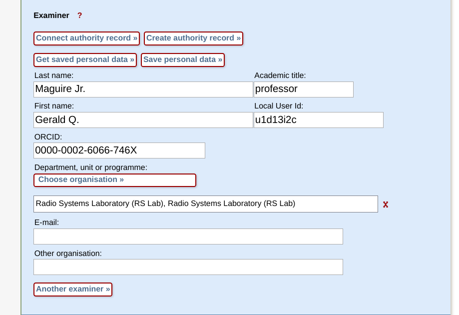
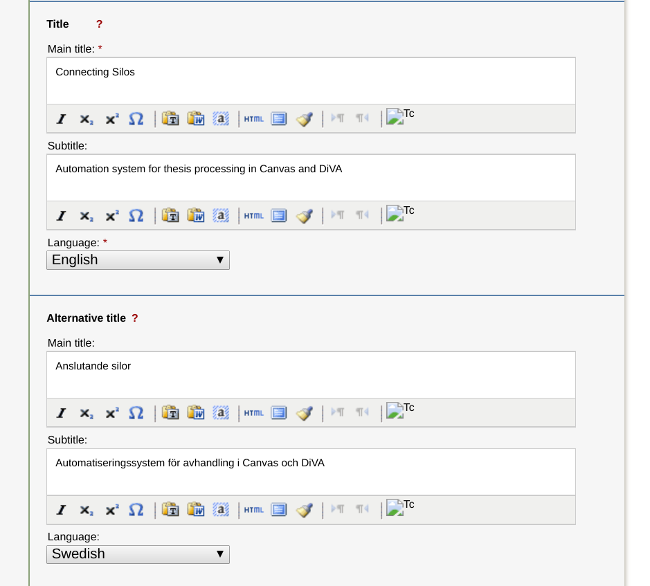

DiVA supports the ability to import a file containing publication meta
data. One of the formats that can be imported into DiVA is Metadata
Object Description Schema (MODS)[^1]. In particular, the variant of MODS
that we will be concerned with is that described in Kungliga
biblioteket/National Library of Sweden, \"SwePub MODS metadata format
specification\", Version 2.6, Datum/Date: 2015-09-10, Dnr/Reference no:
1.4.1-2015-822.

This document will describe an example MODS file and examine it element
by element. Note that this example MODS file has been generated almost
entirely manually. The elements in this MODS file were found by
following the MODS standard (version 3.2), the SwePub MODS (version
2.6), examples and documentation of DiVA's format as given in the DiVA
wiki (<https://wiki.epc.ub.uu.se/display/divainfo/Formatspecifikation>),
exported MODS files for other documents, examininng the Javascripts for
the DIVA GUI, and trial and error. Its purpose was to learn how to fill
in as many of the fields of the DiVA records for a student thesis as
possible (to facilitate importing complete or nearly complete records).
Generating the MODS file via software is the topic of another project.

# Contents {#contents .Unnumbered-heading-1}

[Contents](#contents)

[List of Figures](#list-of-figures)

[List of Tables](#list-of-tables)

[Example MODS file 1](#example-mods-file)

[Start of collection: \<modsCollection ...\>](#start-of-collection-modscollection-)

[Itemn: \<mods ...\>](#itemn-mods-)

[Genren: \<genre ...\>](#genren-genre-)

[Authorn,i: \<name ...\>](#authorni-name-)

[Advisern,i: \<name ...\>](#adviserni-name-)

[Publishern : \<name ...\>](#publishern-name-)

[Examinern: \<name ...\>](#examinern-name-)

[PublisherCorp: \<name ...\>](#publishercorp-name-)

[Title and subtitlen: \<titleInfo ...\>](#title-and-subtitlen-titleinfo-)

[Keywordsn: \<subject ...\>](#keywordsn-subject-)

[Abstractn: \<abstract ...\>](#abstractn-abstract-)

[Degree related information](#degree-related-information)

[Leveln: which degree is this thesis for?](#leveln-which-degree-is-this-thesis-for)

[Creditsn :Number of university creidt for degree project](#creditsn-number-of-university-creidt-for-degree-project)

[Program: Educational program](#program-educational-program)

[Coursen: Subject/Course](#coursen-subjectcourse)

[The results of all of these degree related elements](#the-results-of-all-of-these-degree-related-elements)

[National subject categoryn: Using HSV codes](#national-subject-categoryn-using-hsv-codes)

[Oral presentation (defense) related information](#oral-presentation-defense-related-information)

[Defense languagen](#defense-languagen)

[Defense venuen](#defense-venuen)

[Originn](#originn)

[physicalDescriptionn : The physical description of the book](#physicaldescriptionn-the-physical-description-of-the-book)

[relatedItemn: Information about the series and the number of the publication within this series](#relateditemn-information-about-the-series-and-the-number-of-the-publication-within-this-series)

[Limitations](#limitations)

[Cooperation noten: External collaboration (cannot be imported)](#cooperation-noten-external-collaboration-cannot-be-imported)

[How much is KTH specific?](#how-much-is-kth-specific)

# List of Figures

[Figure 1: DiVA Graphical user interface (GUI) for entering information
about the authors](#user-content-figure1)

[Figure 2: Graphical user interface (GUI) for entering information about
the adviser(s)](#user-content-figure2)

[Figure 3: Graphical user interface (GUI) for entering information about
the examiner](#user-content-figure3)

[Figure 4: GUI view of the titles and subtitles](#user-content-figure4)

[Figure 5: GUI view of keywords](#user-content-figure5)

[Figure 6: GUI view of abstracts](#user-content-figure6)

[Figure 7: DivA GUI view of Degree related elements](#user-content-figure7)

[Figure 8: DiVA GUI view of National subject category](#user-content-figure8)

[Figure 9: Presentation related information](#user-content-figure9)

[Figure 10: DiVA GUI view of other information](#user-content-figure10)

[Figure 11: DiVA GUI view of Series fields](#user-content-figure11)

[Figure 12: GUI for entering information about an external collaboration](#user-content-figure12)

# List of Tables

[Table 1: Example of a MODS file for a 1st cycle student thesis with
two authors (Note that the logical are simply labels for the purpose of
annotation in this explanation and *only* the contents of MODS elements
actually exist in the file.)](#user-content-table1)

[Table 2: KTH specific codes for the coporate publisher-- Note that
there is a \<namePart\>KTH\</namePart\> before each of these other
nameParts, excpet for code 177.](#user-content-table2)

[Table 3: Degree levels (The values are from the Javascript file:
ImportForm.jsf.)](#user-content-table3)

[Table 4: Number of university credits for degree project (The values
are from the Javascript file: ImportForm.jsf.)](#user-content-table4)

[Table 5: Educational program for degree project (The values are from
the Javascript file: ImportForm.jsf.)](#user-content-table5)

[Table 6: Subjects/courses for a degree project (The values are from the
Javascript file: ImportForm.jsf.)](#user-content-table6)

[Table 7: Standard för svensk indelning av forskningsämnen 2011 (Updated
August 2016)](#user-content-table7)

[Table 8: Local identifier for the series of theses (The values are from
the Javascript file: ImportForm.jsf.)](#user-content-table8)

Example MODS file

To help others understand how to create a MODS record for a student
thesis we will look at an example of such a record (see Table 1) and
analyze each part of it. This example is based upon what the MODS file
would contain for the 1st cycle degree project by Qi Li
\<<qi5@kth.se>\> and Shiva Besharat Pour \<<shivabp@kth.se>\> entitled:
*Connecting Silos: Automation system for thesis processing in Canvas and
DiVA*, June 2018.

<a name="table1">Table 1: Example of a MODS file for a 1st
cycle student thesis with two authors (Note that the logical are simply
labels for the purpose of annotation in this explanation and *only* the
contents of MODS elements actually exist in the file.)</a>

                        **MODS file contents**

| **Logical block**    | **MODS element**     | **Description** |
|----------------------|----------------------|----------------------|
| Start of collection  | \<modsCollection     | A collection of \<mods\> elements.|
|                      | xmlns=\"http://www.loc.gov/mods/v3\"     | |
|                      | xmlns:xsi=\"http://www.w3.org/2001/XMLSchema-instance\" | |
|                      | xsi:schemaLocation=\"http://www.loc.gov/mods/v3 | |
|                      | http://www.loc.gov/standards/mods/v3/mods-3-2.xsd\"\> | |
| Start of an Item     | \<mods version=\"3.2\"| Start of a bibliographic item |
|                      | xmlns=\"http://www.loc.gov/mods/v3\" | |
|                      | xmlns:xlink=\"http://www.w3.org/1999/xlink\" | |
|                      | xmlns:xsi=\"http://www.w3.org/2001/XMLSchema-instance\" | |
|                      | xsi:schemaLocation=\"http://www.loc.gov/mods/v3 | |
|                      | http://www.loc.gov/standards/mods/v3/mods-3-2.xsd\"\> | |
| Genren | \<genre              | This element         |
|                      | authority=\"diva\"   | identifies that the item is a student thesis. |
|                      | type=\"publicationTypeCode\"\>studentThesis\</genre\> | |
|                      |                      | Note that there are versions in English, Swedish, and Norwegian. |
|                      | \<genre              | |
|                      | authority=\"diva\"   |         |
|                      | lang=\"swe\"         |            |
|                      | type=\"publicationType\"\>Studentuppsats (Examensarbete)\</genre\> |                      |
|                      | \<genre              |                      |
|                      | authority=\"diva\"   |                      |
|                      | lang=\"eng\"         |                      |
|                      | type=\"publicationType\"\>Student thesis\</genre\>     |                      |
|                      | \<genre              |                      |
|                      | authority=\"diva\"   |                      |
|                      | lang=\"nor\"         |                      |
|                      | type=\"publicationType\"\>Oppgave\</genre\> |                      |
| Authorn,1| \<name               | First author         |
|                      | type=\"personal\"    |                      |
|                      | authority=\"kth\"    |                      |
|                      | xlink:href=\"u1qpyuu7\"\> |                      |
|                      |                      |                      |
|                      | \<namePart           |                      |
|                      | type=\"family\"\>Besharat\</namePart\> |                      |
|                      |                      |                      |
|                      | \<namePart           |                      |
|                      | type=\"given\"\>Shiva\</namePart\> |                      |
|                      |                      |                      |
|                      | \<role\>             |                      |
|                      |                      |                      |
|                      | \<roleTerm           |                      |
|                      | authority=\"marcrelator\" |                      |
|                      | type=\"code\"\>aut\</roleTerm\> |                      |
|                      | \</role\>            |                      |
|                      |                      |                      |
|                      | \<affiliation\>KTH, Radio Systems Laboratory (RS Lab)\</affiliation\> |                      |
|                      |                      |                      |
|                      | \</name\>            |                      |
| Authorn,2 | \<name               | Second author        |
|                      | type=\"personal\"    |                      |
|                      | authority=\"kth\"    |                      |
|                      | xlink:href=\"u1hr9yuk\"\> |                      |
|                      |                      |                      |
|                      | \<namePart           |                      |
|                      | type=\"family\"\>Li\</namePart\> |                      |
|                      | \<namePart           |                      |
|                      | type=\"given\"\>Qi\</namePart\> |                      |
|                      |                      |                      |
|                      | \<role\>             |                      |
|                      | \<roleTerm           |                      |
|                      | authority=\"marcrelator\" |                      |
|                      | type=\"code\"\>aut\</roleTerm\> |                      |
|                      | \</role\>            |                      |
|                      |                      |                      |
|                      | \<affiliation\>KTH, Radio Systems Laboratory (RS Lab)\</affiliation\> |                      |
|                      |                      |                      |
|                      | \</name\>            |                      |
| Advisern,i         | \<name               | Adviser              |
|                      | type=\"personal\"    |                      |
|                      | authority=\"kth\"    |                      |
|                      | xlink:href=\"u1ft3a12\"\> |                      |
|                      |                      |                      |
|                      | \<namePart           |                      |
|                      | type=\"family\"\>V&\#228;stberg\</namePart\> |                      |
|                      |                      |                      |
|                      | \<namePart           |                      |
|                      | type=\"given\"\>Anders\</namePart\> |                      |
|                      |                      |                      |
|                      | \<namePart           |                      |
|                      | type=\"termsOfAddress\"\>Associate Professor\</namePart\> |                      |
|                      |                      |                      |
|                      | \<role\>             |                      |
|                      | \<roleTerm           |                      |
|                      | authority=\"marcrelator\" |                      |
|                      | type=\"code\"\>ths\</roleTerm\> |                      |
|                      | \</role\>            |                      |
|                      |                      |                      |
|                      | \<affiliation\>KTH, Radio Systems Laboratory (RS Lab)\</affiliation\> |                      |
|                      |                      |                      |
|                      | \<description\>orcid.org=0000-0002-4226-9652\</description\> |                      |
|                      |                      |                      |
|                      | \</name\>            |                      |
| Publishern         | \<name\>             | Publisher            |
|                      |                      |                      |
|                      | \<namePart\>KTH\</namePart\> |                      |
|                      |                      |                      |
|                      | \<namePart\>EECS\</namePart\> |                      |
|                      |                      |                      |
|                      | \<namePart\>CoS\</namePart\> |                      |
|                      |                      |                      |
|                      | \<namePart\>RSlab\</namePart\> |                      |
|                      | \<role\>             |                      |
|                      | \<roleTerm           |                      |
|                      | authority=\"marcrelator\" |                      |
|                      | type=\"code\"\>pbl\</roleTerm\> |                      |
|                      | \</role\>            |                      |
|                      |                      |                      |
|                      | \</name\>            |                      |
| Examinern          | \<name               | Examiner             |
|                      | type=\"personal\"    |                      |
|                      | authority=\"kth\"    |                      |
|                      | xlink:href=\"u1d13i2c\"\> |                      |
|                      |                      |                      |
|                      | \<namePart           |                      |
|                      | type=\"family\"\>Maguire Jr.\</namePart\>     |                      |
|                      |                      |                      |
|                      | \<namePart           |                      |
|                      | type=\"given\"\>Gerald Q.\</namePart\>      |                      |
|                      |                      |                      |
|                      | \<namePart           |                      |
|                      | type=\"termsOfAddress\"\>professor\</namePart\> |                      |
|                      |                      |                      |
|                      | \<role\>             |                      |
|                      | \<roleTerm           |                      |
|                      | type=\"code\"        |                      |
|                      | authority=\"marcrelator\"\>mon\</roleTerm\> |                      |
|                      | \</role\>            |                      |
|                      |                      |                      |
|                      | \<affiliation        |                      |
|                      | lang=\"eng\"\>KTH, Radio Systems Laboratory (RS Lab)\</affiliation\> |                      |
|                      |                      |                      |
|                      | \<affiliation        |                      |
|                      | lang=\"swe\"\>KTH, Radio Systems Laboratory (RS Lab)\</affiliation\> |                      |
|                      |                      |                      |
|                      | \<description\>orcid.org=0000-0002-6066-746X\</description\> |                      |
|                      | \</name\>            |                      |
| PublisherCorp        | \<name               |                      |
|                      | type=\"corporate\"   |                      |
|                      | authority=\"kth\"    |                      |
|                      | xlink:href=\"879654\"\> |                      |
|                      |                      |                      |
|                      | \<namePart\>KTH\</namePart\> |                      |
|                      | \<namePart\>Skolan för elektroteknik och datavetenskap (EECS)\</namePart\>  |                      |
|                      | \<namePart\>Kommunikationssystem, CoS\</namePart\>     |                      |
|                      | \<namePart\>Radio Systems Laboratory (RS Lab)\</namePart\>    |                      |
|                      |                      |                      |
|                      | \<role\>             |                      |
|                      | \<roleTerm           |                      |
|                      | type=\"code\"        |                      |
|                      | authority=\"marcrelator\"\>pbl\</roleTerm\> |                      |
|                      | \</role\>            |                      |
|                      | \</name\>            |                      |
| Title and            | \<titleInfo          | Title and subtitle   |
| subtitlen | lang=\"eng\"\>       |                      |
|                      | \<title\>Connecting Silos\</title\>      |                      |
|                      | \<subTitle\>Automation system for thesis processing in Canvas and DiVA\</subTitle\>    |                      |
|                      | \</titleInfo\>       |                      |
|                      |                      |                      |
|                      | \<titleInfo          |                      |
|                      | type=\"alternative\" |                      |
|                      | lang=\"swe\"\>       |                      |
|                      | \<title\>Anslutande silor\</title\>      |                      |
|                      | \<subTitle\>Automatiseringssystem för avhandling i Canvas och DiVA\</subTitle\>    |                      |
|                      | \</titleInfo\>       |                      |
| Keywordsn | \<subject            | Keyword(s)           |
|                      | lang=\"eng\"\>       |                      |
|                      | \<topic\>RESTful APIs\</topic\>       |                      |
|                      | \<topic\>Canvas\</topic\> |                      |
|                      | \<topic\>DiVA\</topic\>       |                      |
|                      | \<topic\>Calendars\</topic\>  |                      |
|                      | \<topic\> data mining\</topic\>     |                      |
|                      | \</subject\>         |                      |
|                      |                      |                      |
|                      | \<subject            |                      |
|                      | lang=\"swe\"\>       |                      |
|                      | \<topic\>RESTful APIs\</topic\>       |                      |
|                      | \<topic\>Canvas\</topic\> |                      |
|                      | \<topic\>DiVA\</topic\> |                      |
|                      | \<topic\>kalendrar\</topic\> |                      |
|                      | \<topic\>data mining\</topic\>     |                      |
|                      | \</subject\>         |                      |
| Abstractn | \<abstract           | Abstract(s)          |
|                      | lang=\"eng\"\>As the era of digitalization dawns, the need to integrate separate silos...\</abstract\> |                      |
|                      |                      |                      |
|                      | \<abstract           |                      |
|                      | lang=\"swe\"\>N&\#228;r digitaliseringens tid uppst&\#229;r, s&\#229; blir behovet av ...\</abstract\>     |                      |
| Leveln| \<note               | Level                |
|                      | type=\"level\"       |                      |
|                      | lang=\"swe\"\>Självständigt arbete på grundnivå (högskoleexamen)\</note\> |                      |
| Creditsn | \<note               | Number of credits    |
|                      | type=\"universityCredits\" |                      |
|                      | lang=\"swe\"\>10 poäng / 15 hp\</note\>          |                      |
| Programn | \<subject            | Program of study     |
|                      | lang=\"eng\"         ||
|                      | authority=\"kth\"    |                      |
|                      | xlink:href=\"9925\"\> |                      |
|                      | \<topic\>Bachelor of Science - Information and Communication Technology\</topic\> |                      |
|                      | \<genre\>Educational program\</genre\>    |                      |
|                      | \</subject\>         |                      |
| Coursen | \<subject            | Specific subject or  |
|                      | lang=\"eng\"         | course               |
|                      | xlink:href=\"10329\"\> |                      |
|                      | \<topic\>Information and Communication Technology\</topic\> |                      |
|                      | \<genre\>Subject/course\</genre\> |                      |
|                      | \</subject\>         |                      |
|                      |                      |                      |
|                      | \<subject            |                      |
|                      | lang=\"swe\"         |                      |
|                      | xlink:href=\"10329\"\> |                      |
|                      | \<topic\>Informations- och kommunikationsteknik\</topic\> |                      |
|                      | \<genre\>Subject/course\</genre\> |                      |
|                      | \</subject\>         |                      |
| National subject     | \<subject            | National subject category |
| categoryn | lang=\"eng\"         |              |
|                      | authority=\"hsv\"    |                      |
|                      | xlink:href=\"20203\"\> |                      |
|                      | \<topic\>Engineering and Technology\</topic\> |                      |
|                      | \<topic\>Communication Systems\</topic\>    |                      |
|                      | \</subject\>         |                      |
|                      |                      |                      |
|                      | \<subject            |                      |
|                      | lang=\"swe\"         |                      |
|                      | authority=\"hsv\"    |                      |
|                      | xlink:href=\"20203\"\> |                      |
|                      | \<topic\>Teknik och teknologier\</topic\> |                      |
|                      | \<topic\>Elektroteknik och elektronik\</topic\> |                      |
|                      | \<topic\>Kommunikationssystem\</topic\> |                      |
|                      | \</subject\>         |                      |
| Cooperation noten | \<note               | External Cooperation |
|                      | type=\"cooperation\"\>Unimplemented in Import to DiVA, NAB\</note\>         |                      |
| Defense languagen | \<language           | Oral presentation information |
|                      | objectPart=\"defence\"\> |                      |
|                      | \<languageTerm       |                      |
|                      | type=\"code\"        |                      |
|                      | authority=\"iso639-2b\"\>eng\</languageTerm\> |                      |
|                      | \</language\>        |                      |
| Defense venuen| \<note               |                      |
|                      | type=\"venue\"\>Seminar room Grimeton at CoS, Electrum - elevator B - 4th floor - Isafjordsgatan 22, Kista\</note\>       |                      |
| Originn | \<originInfo\>       | Dates of thesis      |
|                      | \<dateIssued\>2018\</dateIssued\> |                      |
|                      | \<dateOther          |                      |
|                      | type=\"defence\"\>2018-06-13T10:00:00\</dateOther\> |                      |
|                      | \</originInfo\>      |                      |
| physicalDescriptionn| \<physicalDescription\>| Physical attributes of the publication -- such as number of pages |
|                      | \<extent\>xiii,120\</extent\> |                      |
|                      | \</physicalDescription\> |                      |
| relatedItemn| \<relatedItem        | Series and number of the publication |
|                      | type=\"series\"\>    | |
|                      | \<titleInfo\>        |                      |
|                      | \<title\>TRITA-EECS-EX\</title\> |                      |
|                      | \</titleInfo\>       |                      |
|                      | \<identifier         |                      |
|                      | type=\"local\"\>16855\</identifier\> |                      |
|                      | \<identifier         |                      |
|                      | type=\"issue number\"\>2018:164\</identifier\> |                      |
|                      | \</relatedItem\>     |                      |
| end Item             | \</mods\>            | End of an item       |
| end collection       | \</modsCollection\>  | End of collection    |

# Start of collection: \<modsCollection ...\>

This element contains a number of \<mods\> elements. The tag also
introduces which XML name space is used
(xmlns=<http://www.loc.gov/mods/v3>), name space prefix
(xmlns:xsi=\"<http://www.w3.org/2001/XMLSchema-instance>\" ), and where
the scheme is located (xsi:schemaLocation=\"[http://www.loc.gov/mods/v3
http://www.loc.gov/standards/mods/v3/mods-3-2.xsd](http://www.loc.gov/mods/v3%20http:/www.loc.gov/standards/mods/v3/mods-3-2.xsd)\"\>).

## Itemn: \<mods ...\>

This is a single MODS item. The attributes indicate the version
(version=\"3.2\"), namespace ( xmlns=<http://www.loc.gov/mods/v3>), the
XML Linking Language (XLink) (
xmlns:xlink=<http://www.w3.org/1999/xlink>), the name space prefix (
xmlns:xsi=<http://www.w3.org/2001/XMLSchema-instance>), and location of
the schema ( xsi:schemaLocation=\"[http://www.loc.gov/mods/v3
http://www.loc.gov/standards/mods/v3/mods-3-2.xsd](http://www.loc.gov/mods/v3%20http://www.loc.gov/standards/mods/v3/mods-3-2.xsd)\")

## Genren: \<genre ...\>

This identifies the genre of the item, in this case it is a
"studentThesis". The attribute authority=\"diva\" indicates that the
value of this element is defined by "diva". The attribute
type=\"publicationTypeCode\" indicates that the value of the genre of
this item is a DiVA publication code (\"publicationTypeCode\"). The list
of publication codes can be found at:
<https://wiki.epc.ub.uu.se/display/divainfo/Publikationstyp>

## Authorn,i: \<name ...\>

This \<name\> element identifies the author of the thesis (there may be
several such records). The \<role\>\<roleTerm authority=\"marcrelator\"
type=\"code\"\>aut\</roleTerm\>\<7role\> element and subelement
indicates that this name is the name of one of the authors (aut) of the
publication. The code "aut" is from the U. S. Library of Congress, MARC
Code List for Relators: Term Sequence[^2].

    \<name type=\"personal\" authority=\"kth\" xlink:href=\"u1qpyuu7\"\>
      \<namePart type=\"family\"\>Besharat\</namePart\>
      \<namePart type=\"given\"\>Shiva\</namePart\>
      \<role\>
        \<roleTerm authority=\"marcrelator\" type=\"code\"\>aut\</roleTerm\>
      \</role\>
      \<affiliation\>KTH, Radio Systems Laboratory (RS Lab)\</affiliation\>
    \</name\>

Note that the attribute of \<name\> is type=\"personal\" indicating that
this is the name of a person. While the attribute authority=\"kth\"
indicates that the value of the XLINK (xlink:href=\"u1qpyuu7\") is a KTH
user ID (i.e., KTHID). The \<namePart\> elements values give the
author's family and given names.

The value of the \<affiliation\> element consists of the highest level
of the organization where the author is affiliated (in this case "KTH"),
while the second part is the lowest level of the organizational
affiliation that has been specified (in this case "Radio Systems
Laboratory (RS Lab)". The result of the two authors' \<name\> elements
is shown in Figure 1.

<a name="figure1">Figure 1: DiVA Graphical user interface (GUI)</a>

## Advisern,i: \<name ...\>

This element gives information about the adviser. We know that this is
the role of this person from \<roleTerm authority=\"marcrelator\"
type=\"code\"\>ths\</roleTerm\> as "ths" stands for "Thesis advisor".
Additionally, there is a name part whose attribute indicates that this
is the termsOfAddress (i.e., the title of the person):

    \<namePart type=\"termsOfAddress\"\>Associate Professor\</namePart\>

Additionally, there is a \<description\> that provides the user's ORCID
identifier:

    \<description\>orcid.org=0000-0002-4226-9652\</description\>

The resulting information about the adviser following the import is
shown in Figure 2

")

<a name="figure2">Figure 2: Graphical user interface (GUI) for entering information about the adviser(s)</a>

## Publishern : \<name ...\>

The publisher has the role code "pbl". Note that in this case the
namePart elements are the successive levels of the organization from KTH
down to the unit level:

    \<name\>
      \<namePart\>KTH\</namePart\>
      \<namePart\>EECS\</namePart\>
      \<namePart\>CoS\</namePart\>
      \<namePart\>RSlab\</namePart\>
      \<role\>
        \<roleTerm authority=\"marcrelator\" type=\"code\"\>pbl\</roleTerm\>
      \</role\>
    \</name\>

## Examinern: \<name ...\>

This element is similar to that for the adviser, except that we know the
role of this person is as examiner (mon = Monitor), from:

    \<roleTerm type=\"code\" authority=\"marcrelator\"\>mon\</roleTerm\>

The resulting Graphical user interface (GUI) view of the examiner,
following import is shown in Figure 3.

<a name="figure3">Figure 3: Graphical user interface (GUI) for entering information about the examiner</a>

## PublisherCorp: \<name ...\>

This \<name\> element specifies information about the corporate entity
that is the publisher, based upon the type=\"corporate\". In this case
the authority is authority=\"kth\", hence xlink value is assigned by KTH
(the value \"879654\" is the code for the school of EECS .. RSLab).

    \<name type=\"corporate\" xlink:href=\"879654\"\>
      \<namePart\>KTH\</namePart\>
      \<namePart\>Skolan för elektroteknik och datavetenskap (EECS)\</namePart\>
      \<namePart\>Kommunikationssystem, CoS\</namePart\>
      \<namePart\>Radio Systems Laboratory (RS Lab)\</namePart\>
      \<role\>
        \<roleTerm type=\"code\" authority=\"marcrelator\"\>pbl\</roleTerm\>
      \</role\>
    \</name\>
A list of the codes for the different parts of KTH are listed in Table
2.

<a name="table2">Table 2: KTH specific codes for the coporate
publisher-- Note that there is a \<namePart\>KTH\</namePart\> before
each of these other nameParts, except for code 177.</a>

|  Code   |  School                                                 |   Department                                   |    Unit|
| --------|---------------------------------------------------------|------------------------------------------------|----------------------------------------------------------------------|
|177|\<namePart\>KTH\</namePart\>| | | |
|5850|Skolan för arkitektur och samhällsbyggnad (ABE)| | |
|5921|Centra|Science for Life Laboratory, SciLifeLab|
|5922|Skolan för bioteknologi (BIO)|Centra| Centrum för Bioprocessteknik, CBioPT|
|5934|Skolan för kemivetenskap (CHE)|Kemiteknik|Tillämpad elektrokemi|
|5956|Skolan för datavetenskap och kommunikation (CSC)|
|5958|Skolan för datavetenskap och kommunikation (CSC)|Beräkningsbiologi, CB|
|5963|Skolan för datavetenskap och kommunikation (CSC)|Teoretisk datalogi, TCS|
|5964|Skolan för datavetenskap och kommunikation (CSC)|Tal, musik och hörsel, TMH|
|5967|Skolan för datavetenskap och kommunikation (CSC)|Tal, musik och hörsel, TMH|Musikakustik|
|5969|Skolan för datavetenskap och kommunikation (CSC)|Centra|Centrum för Autonoma System, CAS\|
|5972|Skolan för datavetenskap och kommunikation (CSC)|Centra|Centre for Sustainable Communications, CESC|
|5977|Skolan för elektro- och systemteknik (EES)|
|5978|Skolan för elektro- och systemteknik (EES)|Reglerteknik|
|5980|Skolan för elektro- och systemteknik (EES)|Kommunikationsteori                              
|5981|Skolan för elektro- och systemteknik (EES)|Elektriska energisystem|
|5983|Skolan för elektro- och systemteknik (EES)|Elektroteknisk teori och konstruktion|
|5984|Skolan för elektro- och systemteknik (EES)|Fusionsplasmafysik|
|5985|Skolan för elektro- och systemteknik (EES)|Industriella informations- och styrsystem|
|5987|Skolan för elektro- och systemteknik (EES)|Signalbehandling|
|5988|Skolan för elektro- och systemteknik (EES)|Rymd- och plasmafysik|
|5993|Skolan för elektro- och systemteknik (EES)|Centra|ACCESS Linnaeus Centre|
|5994|Skolan för informations- och kommunikationsteknik (ICT)|
|5998|Skolan för informations- och kommunikationsteknik (ICT)|Kommunikationssystem, CoS|
|6001|Skolan för informations- och kommunikationsteknik (ICT)|Materialfysik (Stängd 20120101)|Materialfysik, MF (Stängd 20120101)|
|6018|Skolan för informations- och kommunikationsteknik (ICT)|Centra|Zhejiang-KTH Joint Research Center of Photonics, JORCEP|
|6021|Skolan för informations- och kommunikationsteknik (ICT)|Centra|VinnExcellence Center for Intelligence in Paper and Packaging, iPACK|
|6025|Skolan för industriell teknik och management (ITM)|Energiteknik|Tillämpad termodynamik och kylteknik|
|6038|Skolan för industriell teknik och management (ITM)|Maskinkonstruktion (Inst.)|
|6046|Skolan för industriell teknik och management (ITM)|Maskinkonstruktion (Inst.)|Produkt- och tjänstedesign|
|6048|Skolan för industriell teknik och management (ITM)|Materialvetenskap|
|6092|Skolan för teknikvetenskap (SCI)|Farkost och flyg|
|6099|Skolan för teknikvetenskap (SCI)|Farkost och flyg|Spårfordon|
|6108|Skolan för teknikvetenskap (SCI)|Tillämpad fysik|
|6118|Skolan för teknikvetenskap (SCI)|Matematik (Inst.)|Optimeringslära och systemteori|
|6164|Skolan för teknik och hälsa (STH)|Medicinsk teknik|
|6181|Tidigare Institutioner (före 2005)|Biokemi och biokemisk teknologi|
|6182|Tidigare Institutioner (före 2005)|Bioteknologi|
|6221|Tidigare Institutioner (före 2005)|Signaler, sensorer och system|
|6222|Tidigare Institutioner (före 2005)|Tal, musik och hörsel|
|10300|Skolan för datavetenskap och kommunikation (CSC)|Medieteknik och interaktionsdesign, MID|
|11800|Skolan för teknikvetenskap (SCI)|Matematik (Inst.)|Numerisk analys, NA|
|11801|Skolan för elektro- och systemteknik (EES)|Mikro- och nanosystemteknik|
|13000|Skolan för informations- och kommunikationsteknik (ICT)|Material- och nanofysik|
|13051|Skolan för informations- och kommunikationsteknik (ICT)|Kommunikationssystem, CoS|Network Systems Laboratory (NS Lab)|
|13052|Skolan för informations- och kommunikationsteknik (ICT)|Kommunikationssystem, CoS|Optical Network Laboratory (ON Lab)|
|13053|Skolan för informations- och kommunikationsteknik (ICT)|Kommunikationssystem, CoS|Radio Systems Laboratory (RS Lab)|
|13054|Skolan för informations- och kommunikationsteknik (ICT)|Programvaruteknik och Datorsystem, SCS|
|13304|Skolan för informations- och kommunikationsteknik (ICT)|Material- och nanofysik|Materialfysik, MF|
|13550|Skolan för datavetenskap och kommunikation (CSC)|Centra|Centre for Sustainable Communications, CESC|
|13600|Skolan för bioteknologi (BIO)|Industriell bioteknologi|
|13601|Skolan för bioteknologi (BIO)|Proteinteknologi|
|13608|Centra|SeRC - Swedish e-Science Research Centre|
|874100|Skolan för datavetenskap och kommunikation (CSC)|Beräkningsvetenskap och beräkningsteknik (CST)|
|874101|Skolan för elektro- och systemteknik (EES)|Elkraftteknik|
|876350|Skolan för industriell teknik och management (ITM)<Centra|Integrated Transport Research Lab, ITRL|
|876903|Skolan för teknikvetenskap (SCI)|Tillämpad fysik|Materialfysik, MF|
|876904|Skolan för teknikvetenskap (SCI)|Tillämpad fysik|Optik och Fotonik, OFO|
|876912|Skolan för informations- och kommunikationsteknik (ICT)|Elektronik|
|876914|Skolan för informations- och kommunikationsteknik (ICT)|Elektronik|Integrerade komponenter och kretsar|
|877050|Skolan för elektro- och systemteknik (EES)|Teknisk informationsvetenskap|
|877051|Skolan för elektro- och systemteknik (EES)|Nätverk och systemteknik|
|878260|Skolan för arkitektur och samhällsbyggnad (ABE)|Hållbar utveckling, miljövetenskap och teknik|Strategiska hållbarhetsstudier|
|879223|Skolan för elektroteknik och datavetenskap (EECS)|
|879224|Skolan för kemi, bioteknologi och hälsa (CBH)|
|879225|Skolan för elektroteknik och datavetenskap (EECS)|Beräkningsvetenskap och beräkningsteknik (CST)|
|879226|Skolan för elektroteknik och datavetenskap (EECS)|Elektroteknisk teori och konstruktion|
|879227|Skolan för elektroteknik och datavetenskap (EECS)|Elkraftteknik|
|879228|Skolan för elektroteknik och datavetenskap (EECS)|Fusionsplasmafysik|
|879229|Skolan för elektroteknik och datavetenskap (EECS)|Medieteknik och interaktionsdesign, MID|
|879230|Skolan för elektroteknik och datavetenskap (EECS)|Mikro- och nanosystemteknik|
|879231|Skolan för elektroteknik och datavetenskap (EECS)|Nätverk och systemteknik|
|879232|Skolan för elektroteknik och datavetenskap (EECS)|Programvaruteknik och datorsystem, SCS|
|879233|Skolan för elektroteknik och datavetenskap (EECS)|Reglerteknik|
|879234|Skolan för elektroteknik och datavetenskap (EECS)|Robotik, perception och lärande, RPL|
|879235|Skolan för elektroteknik och datavetenskap (EECS)|Rymd- och plasmafysik|
|879236|Skolan för elektroteknik och datavetenskap (EECS)|Teknisk informationsvetenskap|
|879237|Skolan för elektroteknik och datavetenskap (EECS)|Teoretisk datalogi, TCS|
|879238|Skolan för elektroteknik och datavetenskap (EECS)|Centra|Parallelldatorcentrum, PDC|
|879241|Skolan för elektroteknik och datavetenskap (EECS)|Centra|KTH Center för trådlösa system, Wireless\@kth|
|879243|Skolan för teknikvetenskap (SCI)|Centra|Zhejiang-KTH Joint Research Center of Photonics, JORCEP|
|879245|Skolan för elektroteknik och datavetenskap (EECS)|Centra|Centrum för autonoma systen, CAS|
|879247|Skolan för elektroteknik och datavetenskap (EECS)|Centra|ACCESS Linnaeus Centre|
|879249|Skolan för elektroteknik och datavetenskap (EECS)|Elektronik|
|879301|Skolan för elektroteknik och datavetenskap (EECS)|Elektronik|Integrerade komponenter och kretsar|
|879302|Skolan för elektroteknik och datavetenskap (EECS)|Tal, musik och hörsel, TMH|
|879303|Skolan för elektroteknik och datavetenskap (EECS)|Tal, musik och hörsel, TMH|Musikakustik|
|879305|Skolan för elektroteknik och datavetenskap (EECS)|Kommunikationssystem, CoS|
|879322|Skolan för kemi, bioteknologi och hälsa (CBH)|Medicinteknik och hälsosystem|Ergonomi|
|879332|Skolan för kemi, bioteknologi och hälsa (CBH)|Kemiteknik|Tillämpad elektrokemi|
|879346|Skolan för kemi, bioteknologi och hälsa (CBH)<Proteinvetenskap|Proteinteknologi|
|879652|Skolan för elektroteknik och datavetenskap (EECS)|Kommunikationssystem, CoS|Network Systems Laboratory (NS Lab)|
|879653|Skolan för elektroteknik och datavetenskap (EECS)|Kommunikationssystem, CoS|Optical Network Laboratory (ON Lab)|
|879654|Skolan för elektroteknik och datavetenskap (EECS)|Kommunikationssystem, CoS|Radio Systems Laboratory (RS Lab)|

## Title and subtitlen: \<titleInfo ...\>

This element specifies the \<title\> and \<subtitle\> and the attribute
"lang" indicates the language of the element's value.

    \<titleInfo lang=\"eng\"\>
      \<title\>Connecting Silos\</title\>
      \<subTitle\>Automation system for thesis processing in Canvas and
DiVA\</subTitle\>
    \</titleInfo\>
    \<titleInfo type=\"alternative\" lang=\"swe\"\>
      \<title\>Anslutande silor\</title\>
      \<subTitle\>Automatiseringssystem för avhandling i Canvas och DiVA\</subTitle\>
    \</titleInfo\>

The GUI view of the title(s) and subtitle(s) after import are shown in
Figure 4.

<a name="figure4">Figure 4: GUI view of the titles and subtitles</a>

## Keywordsn: \<subject ...\>

Using a \<subject\> element containing \<topic\> elements one can
specify keywords for a publication, in this case:

    \<subject lang=\"eng\"\>
      \<topic\>RESTful APIs\</topic\>
      \<topic\>Canvas\</topic\>
      \<topic\> DiVA\</topic\>
      \<topic\> Calendars\</topic\>
      \<topic\> data mining\</topic\>
    \</subject\>
    \<subject lang=\"swe\"\>
      \<topic\>RESTful APIs\</topic\>
      \<topic\>Canvas\</topic\>
      \<topic\>DiVA\</topic\>
      \<topic\>kalendrar\</topic\>
      \<topic\>data mining\</topic\>
    \</subject\>

The results of importing the above keywords in English and Swedish are
shown in Figure 5.

<a name="figure5">Figure 5: GUI view of keywords</a>

## Abstractn: \<abstract ...\>

    \<abstract lang=\"eng\"\>As the era of digitalization dawns, the need to integrate separate silos...\</abstract\>

    \<abstract lang=\"swe\"\>N&\#228;r digitaliseringens tid uppst&\#229;r, s&\#229; blir behovet av ...\</abstract\>

The results of importing the above keywords in English and Swedish are
shown in Figure 6.

<a name="figure6">Figure 6: GUI view of abstracts</a>

# Degree related information

There are a number of different elements that contain information about
the degree associated with the degree project.

**Leveln: which degree is this thesis for?**
----------------------------------------------

To record what level a student thesis is written for, a \<note
type=\"level\"...\> is used. The language used seems to always be
Swedish and the values that are used are shown in Table 3. An example
is:

    \<note type=\"level\" lang=\"swe\"\>Självständigt arbete på grundnivå (högskoleexamen)\</note\>

<a name="table3">Table 3: Degree levels (The values are from the
Javascript file: ImportForm.jsf.)</a>

|  Option code in DiVA GUI |  Value of the element|
|-------------------------- |----------------------------------------------------------------|
|H1|Självständigt arbete på avancerad nivå (magisterexamen)|
|H2|Självständigt arbete på avancerad nivå (masterexamen)|
|H3|Självständigt arbete på avancerad nivå (yrkesexamen)|
|M1|Självständigt arbete på grundnivå (högskoleexamen)|
|M2|Självständigt arbete på grundnivå (kandidatexamen)|
|M4|Självständigt arbete på grundnivå (konstnärlig högskoleexamen)|
|M5|Självständigt arbete på grundnivå (konstnärlig kandidatexamen)|
|M3|Självständigt arbete på grundnivå (yrkesexamen)|
|L2|Studentarbete andra termin|
|L1|Studentarbete första termin|
|L3|Studentarbete övrigt|

Creditsn **:Number of university creidt for degree project**
--------------------------------------------------------------

To record how many credits a student thesis is worth, \<note
type=\"universityCredits\" ...\> is used. The language used seems to
always be Swedish and the values that are used are shown in . An example
is:

\<note type=\"universityCredits\" lang=\"swe\"\>10 poäng / 15
hp\</note\>

<a name="table4">Table 4: Number of university credits for
degree project (The values are from the Javascript file:
ImportForm.jsf.)</a>

|  Option code in DiVA GUI |  Value of the element|
|--------------------------|----------------------|
|4|5 hp|
|5|7,5 hp|
|7|10 hp|
|8|12 hp|
|10|15 hp|
|12|18 hp|
|15|22,5 hp|
|16|16 hp|
|17|20hp|
|20|30 hp|
|25|37,5 hp|
|30|45 hp|
|40|60 hp|
|60|90 hp|
|80|120 hp|
|120|180 hp|
|140|210 hp|
|160|240 hp|
|200|300 hp|
|220|330 hp|

Program: Educational program
----------------------------

The educational program that a student is enrolled in when doing their
degree project is recorded using a \<subject authority=\"kth\" ...\>
element. As the authority is KTH, the XLINK uses a KTH specific
numerical code. An example of such an entry is:

    \<subject lang=\"eng\" authority=\"kth\" xlink:href=\"9925\"\>
      \<topic\>Bachelor of Science - Information and Communication Technology\</topic\>
      \<genre\>Educational program\</genre\>
    \</subject\>

<a name="table5">Table 5: KTH's Educational programs for degree
project (The values are from the Javascript file: ImportForm.jsf.)</a>

|  Option code in DiVA GUI |  Value of the element |
|-------------------------|-----------------------------------------------------------------------------------------------------------------------|
| 10520                     |Arkitektexamen|
| 9558                      |Arkitektexamen - Arkitektur|
| 10500                     |Civilingenjörsexamen|
| 9871                      |Civilingenjörsexamen - Bioteknik|
| 9973                      |Civilingenjörsexamen - Civilingenjör och lärare|
| 9889                      |Civilingenjörsexamen - Datateknik|
| 9942                      |Civilingenjörsexamen - Design och produktframtagning|
| 9905                      |Civilingenjörsexamen - Elektroteknik|
| 9943                      |Civilingenjörsexamen - Energi och miljö|
| 9974                      |Civilingenjörsexamen - Farkostteknik|
| 9944                      |Civilingenjörsexamen - Industriell ekonomi|
| 9918                      |Civilingenjörsexamen - Informationsteknik|
| 9878                      |Civilingenjörsexamen - Kemivetenskap|
| 9945                      |Civilingenjörsexamen - Maskinteknik|
| 9946                      |Civilingenjörsexamen - Materialdesign|
| 9987                      |Civilingenjörsexamen - Medicinsk teknik|
| 9890                      |Civilingenjörsexamen - Medieteknik|
| 9919                      |Civilingenjörsexamen - Mikroelektronik|
| 10526                     |Civilingenjörsexamen - Samhällsbyggnad|
| 9975                      |Civilingenjörsexamen - Teknisk fysik|
| 10521                     |Högskoleexamen|
| 9802                      |Högskoleexamen - Byggproduktion|
| 9803                      |Högskoleexamen - Byggteknik och fastighetsförmedling|
| 10522                     |Högskoleingenjörsexamen|
| 9800                      |Högskoleingenjörsexamen - Byggteknik och design|
| 9801                      |Högskoleingenjörsexamen - Byggteknik och ekonomi|
| 10751                     |Högskoleingenjörsexamen - Byggteknik och hälsa|
| 9989                      |Högskoleingenjörsexamen - Datateknik och ekonomi|
| 9921                      |Högskoleingenjörsexamen - Datateknik|
| 9990                      |Högskoleingenjörsexamen - Datateknik|
| 9922                      |Högskoleingenjörsexamen - Elektronik och datorteknik|
| 9949                      |Högskoleingenjörsexamen - Elektroteknik och ekonomi|
| 9907                      |Högskoleingenjörsexamen - Elektroteknik|
| 9948                      |Högskoleingenjörsexamen - Elektroteknik|
| 9880                      |Högskoleingenjörsexamen - Kemiteknik|
| 9951                      |Högskoleingenjörsexamen - Maskinteknik och ekonomi|
| 9950                      |Högskoleingenjörsexamen - Maskinteknik|
| 9991                      |Högskoleingenjörsexamen - Medicinsk teknik|
| 9992                      |Högskoleingenjörsexamen - Teknik och ekonomi|
| 10523                     |Teknologie kandidatexamen|
| 9924                      |Teknologie kandidatexamen - Affärssystem|
| 10950                     |Teknologie kandidatexamen - Arkitektur|
| 17650                     |Teknologie kandidatexamen - Energi och miljö|
| 9804                      |Teknologie kandidatexamen - Fastighet och finans|
| 9805                      |Teknologie kandidatexamen - Fastighetsutveckling med fastighetsförmedling|
| 9925                      |Teknologie kandidatexamen - Informations- och kommunikationsteknik|
| 9994                      |Teknologie kandidatexamen - Medicinsk informatik|
| 9892                      |Teknologie kandidatexamen - Simuleringsteknik och virtuell design|
| 10524                     |Teknologie magisterexamen|
| 9996                      |Teknologie magisterexamen - Arbete och hälsa|
| 9997                      |Teknologie magisterexamen - Datornätverk|
| 9858                      |Teknologie magisterexamen - Design och byggande|
| 9953                      |Teknologie magisterexamen - Entreprenörskap och innovationsledning|
| 9998                      |Teknologie magisterexamen - Ergonomi och Människa-Teknik-Organisation|
| 9999                      |Teknologie magisterexamen - Ljusdesign|
| 9954                      |Teknologie magisterexamen - Produktframtagning|
| 9955                      |Teknologie magisterexamen - Projektledning och verksamhetsutveckling|
| 14553                     |Teknologie magisterexamen - Teknik, hälsa och arbetsmiljöutveckling|
| 9956                      |Teknologie magisterexamen - Tillämpad logistik|
| 10525                     |Teknologie masterexamen|
| 9970                      |Teknologie masterexamen - Aeroelasticitet i turbomaskiner|
| 9860                      |Teknologie masterexamen - Arkitektur|
| 9894                      |Teknologie masterexamen - Beräknings- och systembiologi|
| 9875                      |Teknologie masterexamen - Beräkningskemi och beräkningsfysik|
| 9895                      |Teknologie masterexamen - Datalogi|
| 9901                      |Teknologie masterexamen - Datorsimuleringar inom teknik och naturvetenskap|
| 9938                      |Teknologie masterexamen - Distribuerade system|
| 9909                      |Teknologie masterexamen - Elektrofysik|
| 9910                      |Teknologie masterexamen - Elkraftteknik|
| 9859                      |Teknologie masterexamen - Fastighetsföretagande|
| 9861                      |Teknologie masterexamen - Fastighetsutveckling och finansiella tjänster|
| 9868                      |Teknologie masterexamen - Fastighetsvetenskap|
| 9977                      |Teknologie masterexamen - Flyg- och rymdteknik|
| 9978                      |Teknologie masterexamen - Fordonsteknik|
| 9927                      |Teknologie masterexamen - Fotonik|
| 9914                      |Teknologie masterexamen - Fusionsenergi och teknisk fysik|
| 9862                      |Teknologie masterexamen - Geodesi och geoinformatik|
| 24400                     |Teknologie masterexamen - Husbyggnads- och anläggningsteknik|
| 9850                      |Teknologie masterexamen - Huskonstruktion|
| 9958                      |Teknologie masterexamen - Hållbar energiteknik|
| 9552                      |Teknologie masterexamen - Hållbar samhällsplanering och stadsutformning|
| 9928                      |Teknologie masterexamen - Inbyggda system|
| 9959                      |Teknologie masterexamen - Industriell ekonomi|
| 9873                      |Teknologie masterexamen - Industriell och miljöinriktad bioteknologi|
| 9961                      |Teknologie masterexamen - Industriell produktion|
| 9962                      |Teknologie masterexamen - Industriell produktutveckling|
| 9929                      |Teknologie masterexamen - Informations- och kommunikationssäkerhet|
| 9915                      |Teknologie masterexamen - Informations- och kommunikationsteknik, forskningsförberedande|
| 9864                      |Teknologie masterexamen - Innovations- och tillväxtekonomi|
| 9966                      |Teknologie masterexamen - Innovativ uthållig energiteknik|
| 9963                      |Teknologie masterexamen - Integrerad produktdesign|
| 13450                     |Teknologie masterexamen - Internetteknik|
| 9882                      |Teknologie masterexamen - Kemiteknik för energi och miljö|
| 9939                      |Teknologie masterexamen - Kommunikationssystem|
| 9930                      |Teknologie masterexamen - Konstruktion och realisering av IT-produkter och -system|
| 9979                      |Teknologie masterexamen - Kärnenergiteknik|
| 10001                     |Teknologie masterexamen - Ljus, design och hälsa|
| 9883                      |Teknologie masterexamen - Makromolekylära material|
| 9980                      |Teknologie masterexamen - Marina system|
| 9984                      |Teknologie masterexamen - Marinteknik|
| 9896                      |Teknologie masterexamen - Maskininlärning|
| 9981                      |Teknologie masterexamen - Matematik|
| 9885                      |Teknologie masterexamen - Material och sensorsystem för miljötekniska tillämpningar|
| 11254                     |Teknologie masterexamen - Materialteknik|
| 9897                      |Teknologie masterexamen - Media management|
| 10002                     |Teknologie masterexamen - Medicinsk bildbehandling|
| 9874                      |Teknologie masterexamen - Medicinsk bioteknologi|
| 10003                     |Teknologie masterexamen - Medicinsk teknik|
| 9898                      |Teknologie masterexamen - Medieteknik|
| 9863                      |Teknologie masterexamen - Miljöteknik och hållbar infrastruktur|
| 9969                      |Teknologie masterexamen - Miljövänliga energisystem|
| 9884                      |Teknologie masterexamen - Molekylär vetenskap och teknik|
| 9899                      |Teknologie masterexamen - Människa-datorinteraktion|
| 9931                      |Teknologie masterexamen - Nanoteknik|
| 9911                      |Teknologie masterexamen - Nätverkstjänster och system|
| 9932                      |Teknologie masterexamen - Programvaruteknik för distribuerade system|
| 13400                     |Teknologie masterexamen - Samhällsplanering|
| 9902                      |Teknologie masterexamen - Systembiologi|
| 9933                      |Teknologie masterexamen - Systemkonstruktion på kisel|
| 9912                      |Teknologie masterexamen - Systemteknik och robotik|
| 9937                      |Teknologie masterexamen - Säker och mobil kommunikation|
| 9934                      |Teknologie masterexamen - Teknik för interaktiva system|
| 9964                      |Teknologie masterexamen - Teknik och hållbar utveckling|
| 9968                      |Teknologie masterexamen - Teknik och ledning för energi- och miljösystem|
| 9935                      |Teknologie masterexamen - Teknik och ledning för informationssystem|
| 9983                      |Teknologie masterexamen - Teknisk fysik|
| 9865                      |Teknologie masterexamen - Teknisk infrastruktur|
| 9965                      |Teknologie masterexamen - Teknisk materialvetenskap|
| 9982                      |Teknologie masterexamen - Teknisk mekanik|
| 9900                      |Teknologie masterexamen - Tekniska beräkningar|
| 23002                     |Teknologie masterexamen - Tillämpad matematik och beräkningsmatematik|
| 21652                     |Teknologie masterexamen - Transport och geoinformatik|
| 9866                      |Teknologie masterexamen - Transportsystem|
| 9913                      |Teknologie masterexamen - Trådlösa system|
| 13401                     |Teknologie masterexamen - Urban planering och design|
| 28050                     |Teknologie masterexamen - Urbana studier|
| 9867                      |Teknologie masterexamen - Vattensystemteknik|
| 9557                      |Z - Skolan för arkitektur och samhällsbyggnad (ABE)|
| 9852                      |Skolan för arkitektur och samhällsbyggnad (ABE) - Civilingengörsexamen|
| 29550                     |Övriga utbildningsprogram|
| 30301                     |Kompletterande pedagogisk utbildning för ämneslärarexamen i matematik, naturvetenskap och teknik för forskarutbildade|
| 30300                     |Kompletterande pedagogisk utbildning|
| 29551                     |Ämneslärarutbildning med inriktning mot teknik, årskurs 7-9|

Coursen: Subject/Course
-------------------------

The subject/course program that a student is enrolled in when doing
their degree project is recorded using a \<subject authority=\"kth\"
...\> element. As the authority is KTH, the XLINK uses a KTH specific
numerical code. An example of such an entry is:

    \<subject lang=\"eng\" xlink:href=\"10329\"\>
      \<topic\>Information and Communication Technology\</topic\>
      \<genre\>Subject/course\</genre\>
    \</subject\>
    \<subject lang=\"swe\" xlink:href=\"10329\"\>
      \<topic\>Informations- och kommunikationsteknik\</topic\>
      \<genre\>Subject/course\</genre\>
    \</subject\>

<a name="table6">Table 6: Subjects/courses for a degree project
and their codes for KTH (The values are from the Javascript file:
ImportForm.jsf.)</a>

|  Option code in DiVA GUI |  Value of the element                       |
| -------------------------|---------------------------------------------|
|10260|Acceleratorteknik|
|10261|Analytisk kemi|
|10447|Anläggningar för infrastruktur|
|10262|Antennsystemteknik|
|10263|Arbetsvetenskap|
|10264|Arkitektur|
|10265|Bearbetningsteknik|
|10266|Bebyggelseanalys|
|10267|Beräkningsteknik|
|10268|Betongbyggnad|
|10269|Biokompositer|
|10270|Biomedicinsk teknik|
|10271|Bioteknik|
|10253|Bioteknologi|
|10272|Brobyggnad|
|10273|Bygg- och fastighetsekonomi|
|10274|Byggandets organisation och ekonomi|
|10448|Byggdesign|
|10275|Byggnadsmateriallära|
|10276|Byggnadsstatik|
|10277|Byggnadsteknik|
|10278|Byggprojektledning|
|10450|Byggteknik och design med ekonomi|
|10451|Byggteknik och design|
|10449|Byggteknik|
|10279|Data- och systemvetenskap|
|10280|Datalogi|
|10452|Datateknik med ekonomi|
|10453|Datateknik med industriell ekonomi|
|10454|Datateknik och grafikprogrammering|
|10455|Datateknik och programutveckling|
|10456|Datateknik och realtidsprogrammering|
|10457|Datateknik, nätverk och säkerhet|
|10458|Datateknik, program- och systemutveckling|
|10281|Datorkommunikation|
|10459|Datornät|
|10460|Datornätverk och kommunikation|
|10282|Datornätverk|
|10283|Datorsystem|
|10284|Design och byggande|
|10445|Design och produktframtagning|
|10285|Diskret matematik|
|10286|Effektelektronik|
|10287|Elektrisk mätteknik|
|10288|Elektriska anläggningar|
|10289|Elektriska energisystem|
|10290|Elektriska maskiner och drivsystem|
|10291|Elektriska maskiner och kraftelektronik|
|10292|Elektroakustik|
|10461|Elektronik och kommunikation|
|10293|Elektronik- och datorsystem|
|10462|Elektronikkonstruktion|
|10294|Elektroniksystemkonstruktion|
|10463|Elektroteknik med industriell ekonomi|
|10295|Elektroteknik|
|10296|Energi och klimatstudier|
|10297|Energi- och ugnsteknik|
|10298|Energiprocesser|
|10251|Energiteknik|
|10255|Entreprenörskap och innovationsledning|
|10300|Ergonomi|
|10446|Farkostteknik|
|10301|Fasta tillståndets elektronik|
|10302|Fastighetsekonomi|
|10303|Fastighetsteknik|
|10254|Fastighetsvetenskap|
|10304|Fiberteknologi|
|10305|Filosofi|
|28052|Finansiell matematik|
|10464|Finans|
|10306|Flygteknik|
|10307|Fordonsteknik|
|10308|Fotonik med mikrovågsteknik|
|10309|Fusionsplasmafysik|
|10311|Fysikalisk elektroteknik|
|10312|Fysikalisk kemi|
|10310|Fysik|
|10313|Förbränningsmotorteknik|
|10465|Förvaltning|
|10314|Geodesi|
|10315|Geoinformatik|
|10316|Gjuteriteknik|
|10317|Grundvattenkemi|
|10318|Halvledarmaterial|
|10319|Hydraulik och pneumatik|
|10750|Hållbar utveckling|
|10320|Hållfasthetslära|
|10321|Högspänningsteknik|
|10466|Inbyggda system|
|10322|Industriell bioteknologi|
|10323|Industriell design|
|10324|Industriell ekologi|
|10468|Industriell ekonomi och entreprenörsskap|
|10469|Industriell ekonomi och produktion|
|10325|Industriell ekonomi|
|10467|Industriell IT|
|10326|Industriell produktion|
|10327|Industriella styrsystem|
|10328|Information- och programvarusystem|
|10329|Informations- och kommunikationsteknik|
|10330|Informationsteknik|
|10470|Innovation och design|
|10257|Innovations- och tillväxtekonomi|
|10471|Installationsteknik och energi|
|10331|Integrerad produktutveckling|
|10332|Jord- och bergmekanik|
|10333|Järnväg och tågtrafik|
|10334|Järnvägsteknik|
|10335|Kemiteknik|
|10472|Kemivetenskap|
|10336|Keramiska material|
|10337|Keramteknologi|
|10338|Kommunikationsnät|
|10339|Kommunikationssystem|
|10340|Kommunikationsteori|
|10341|Kondenserade materiens fysik|
|10474|Konstruktionsteknik|
|10473|Konstruktion|
|10342|Korrosionslära|
|10343|Kraft- och värmeteknologi|
|10344|Kretselektronik|
|10345|Kylteknik|
|10346|Kärnkemi|
|10347|Kärnkraftsäkerhet|
|10348|Ljud- och bildbehandling|
|10258|Ljusdesign och hälsa|
|10349|Ljusdesign|
|10475|Logistik, ekonomi och produktion|
|10350|Logistik|
|10351|Läran om maskinelement|
|10352|Lättkonstruktioner|
|10353|Marina system|
|10252|Mark- och fastighetsjuridik|
|10354|Mark- och vattenresurslära|
|10355|Maskinelement|
|10356|Maskinkonstruktion|
|10477|Maskinteknik med industriell ekonomi|
|10476|Maskinteknik|
|10357|Massateknologi|
|10358|Matematik|
|10359|Matematisk statistik|
|10360|Material och processdesign|
|10444|Materialdesigns|
|10361|Materialens processteknologi|
|10362|Materialens processvetenskap|
|10363|Materialfysik|
|10478|Materialvetenskap|
|10364|Medicinsk bildbehandling|
|10365|Medicinsk teknik|
|10366|Medieteknik|
|10367|Mekanik|
|10368|Mekanisk metallografi|
|10369|Mekanisk värmeteori|
|10479|Mekatronik och robotik|
|10370|Mekatronik|
|10371|Metallernas gjutning|
|10372|Metallografi|
|10373|Mikrodatorsystem|
|10374|Mikroelektronik och tillämpad fysik|
|10375|Mikromodellering inom processvetenskap|
|10376|Miljöbedömning|
|10377|Miljöstrategisk analys|
|10480|Mobil kommunikation|
|10378|Molekylär bioteknik|
|10379|Musikakustik|
|10380|Människa - datorinteraktion|
|10381|Numerisk analys|
|10382|Oorganisk kemi|
|10383|Optik|
|10384|Optimeringslära och systemteori|
|10385|Organisk kemi|
|10386|Pappersteknik|
|10387|Plasmafysik|
|10388|Polymera material|
|10389|Polymerteknologi|
|10390|Produktframtagning|
|10481|Produktionsteknik|
|10482|Programutveckling|
|10391|Programvaruteknik|
|10483|Programvaruutveckling|
|10484|Projektering|
|10392|Projektledning och verksamhetsutveckling|
|10393|Radioelektronik|
|10394|Radiosystemteknik|
|10395|Reaktorteknologi|
|10396|Regional planering|
|10397|Reglerteknik|
|10398|Risk och säkerhet|
|10443|Rymd- och plasmafysik|
|10399|Rymdfysik|
|10485|Samhällsbyggnad|
|10400|Signalbehandling|
|10401|Stadsplanering och design|
|10402|Strömningsmekanik|
|10403|Stålbyggnad|
|10404|System på kisel|
|10405|Systemanalys och ekonomi|
|10406|Systemteknik|
|10486|Systemutveckling|
|10407|Säkerhetsforskning|
|10408|Talkommunikation|
|10409|Talöverföring|
|10410|Teknik i vården, biomekanik|
|10411|Teknik och lärande|
|10487|Teknik och management|
|10412|Teknikhistoria|
|10413|Teknisk akustik|
|10488|Teknisk fysik|
|10414|Teknisk geodesi|
|10415|Teknisk materialfysik|
|10489|Tele- och datakommunikation|
|10416|Teleinformatik|
|10417|Telekommunikationssystem|
|10418|Teoretisk elektroteknik|
|10419|Teoretisk fysik|
|10420|Termodynamisk modellering|
|10421|Tillförlitlighetsananlys för elkraftsystem|
|10422|Tillämpad fysik|
|10423|Tillämpad informationsteknik|
|10424|Tillämpad logistik|
|28053|Tillämpad matematik och industriell ekonomi|
|10425|Tillämpad matematisk analys|
|10426|Tillämpad materialfysik|
|10427|Tillämpad materialteknologi|
|10428|Tillämpad processmetallurgi|
|10429|Tillämpad termodynamik|
|10430|Trafik- och transportplanering|
|10431|Trafikplanering|
|10432|Transport- och lokaliseringsanalys|
|10433|Träkemi|
|10434|Träteknologi|
|10435|Uppvärmnings- och ventilationsteknik|
|20650|Urban och regional planering|
|10436|Uthålliga byggnader|
|10259|VA och avfall|
|10437|Vattenbyggnad|
|10438|Vattenvårdsteknik|
|10439|Vägteknik|
|10440|Värmetransporter|
|10441|Ytbehandlingsteknik|
|10442|Ytkemi|

The results of all of these degree related elements
---------------------------------------------------

Figure 7 shows the results of all of the degree related elements as shown via the DiVA GUI.

<a name="figure7">Figure 7: DivA GUI view of Degree related elements</a>

# National subject categoryn: Using HSV codes

These categories are defined in Högskoleverket (HSV) (now
Universitetskanslersämbetet, UKÄ) and Statistiska centralbyrån
(SCB),"Standard för svensk indelning av forskningsämnen 2011",
Uppdaterad augusti 2016\
<http://www.scb.se/contentassets/10054f2ef27c437884e8cde0d38b9cc4/standard-for-svensk-indelning--av-forskningsamnen-2011-uppdaterad-aug-2016.pdf>

    \<subject lang=\"eng\" authority=\"hsv\" xlink:href=\"20203\"\>
      \<topic\>Engineering and Technology\</topic\>
      \<topic\>Electrical Engineering, Electronic Engineering, Information Engineering\</topic\>
      \<topic\>Communication Systems\</topic\>
    \</subject\>
    \<subject lang=\"swe\" authority=\"hsv\" xlink:href=\"20203\"\>
      \<topic\>Teknik och teknologier\</topic\>
      \<topic\>Elektroteknik och elektronik\</topic\>
      \<topic\>Kommunikationssystem\</topic\>
    \</subject\>

<a name="figure8">Figure 8: DiVA GUI view of National subject category</a>

<a name="table7">Table 7: Standard för svensk indelning av
forskningsämnen 2011 (Updated August 2016)</a>

| HSV code             | Swedish              | English              |
|----------------------|----------------------|----------------------|
| **Naturvetenskap**   |                      |                      |
| 1| Naturvetenskap| Natural sciences|
| 101| Matematik| Mathematics|
| 10101| Matematisk analys| Mathematical Analysis|
| 10102| Geometri| Geometry|
| 10103| Algebra och logik| Algebra and Logic|
| 10104| Diskret matematik| Discrete Mathematics |
| 10105| Beräkningsmatematik  | Computational Mathematics|
| 10106| Sannolikhetsteori och statistik | Probability Theory and Statistics       |
| 10199| Annan matematik| Other Mathematics|
|----------------------|----------------------|----------------------|
| 102| Data- och informationsvetenskap  (Datateknik)| Computer and Information Sciences |
| 10201| Datavetenskap (datalogi) | Computer Sciences|
| 10202| Systemvetenskap, informationssystem och informatik (samhällsvetenskaplig inriktning under 50804)   | Information Systems (Social aspects to be 50804)|
| 10203| Bioinformatik (beräkningsbiologi)       | Bioinformatics (Computational Biology)|
|      | (tillämpningar under 10610) | (applications to be 10610)|
| 10204| Människa-datorinteraktion (interaktionsdesign) | Human Computer Interaction |
| | (Samhällsvetenskapliga  aspekter under  50803) | (Social aspects to be 50803)|
| 10205| Programvaruteknik    | Software Engineering |
| 10206| Datorteknik          | Computer Engineering |
| 10207| Datorseende och robotik (autonoma system) | Computer Vision and Robotics (Autonomous Systems)|
| 10208| Språkteknologi (språkvetenskaplig databehandling)| Language Technology (Computational Linguistics)|
| 10209| Medieteknik| Media and Communication Technology|
| 10299| Annan data- och informationsvetenskap| Other Computer and Information Science|
| 103| Fysik| Physical Sciences |
| 10301| Subatomär fysik| Subatomic Physics|
| | Häri ingår\:| Including\: |
| | fält- och partikelfysik|  Particle and Field Physics|
| | astropartikelfysik   | Astroparticle Physics|
| | kärnfysik            | Nuclear Physics      |
| 10302| Atom- och  molekylfysik och optik| Atom and Molecular Physics and Optics|
| | Häri ingår\:          | Including\:           |
| | kemisk fysik         | Chemical Physics     |
| | laseroptik           | Laser Optics         |
| | kvantoptik           | Quantum Optics       |
| 10303| Fusion, plasma och rymdfysik| Fusion, Plasma and Space Physics
| 10304| Den kondenserade materiens fysik| Condensed Matter Physics|
| 10305| Astronomi, astrofysik och kosmologi| Astronomy, Astrophysics and Cosmology|
| 10306| Acceleratorfysik och instrumentering| Accelerator Physics and Instrumentation|
| 10399| Annan fysik| Other Physics Topics |
| 104| Kemi |  Chemical Sciences|
| 10401| Analytisk kemi       | Analytical Chemistry |
| 10402| Fysikalisk kemi| Physical Chemistry|
| | Häri ingår\:| Including\:|
| | kolloidkemi| Colloid Chemistry|
| 10403| Materialkemi| Materials Chemistry  |
| 10404| Oorganisk kemi       | Inorganic Chemistry  |
| | Häri ingår\:| Including\:|
| | elektrokemi| Electrochemistry|
| | kärnkemi| Nuclear Chemistry|
| 10405| Organisk kemi| Organic Chemistry|
| 10406| Polymerkemi| Polymer Chemistry|
| 10407| Teoretisk kemi| Theoretical Chemistry|
| | Häri ingår\:| Including\:|
| | kvantkemi| Quantum Chemistry|
| 10499| Annan kemi| Other Chemistry Topics|
| 105| Geovetenskap och miljövetenskap| Earth and Related Environmental Sciences|
| 10501| Klimatforskning| Climate Research|
| 10502| Miljövetenskap  (Samhällsvetenskapliga aspekter under 507)| Environmental Sciences (social aspects to be 507)|
| 10503| Multidisciplinär geovetenskap| Geosciences, Multidisciplinary|
| 10504| Geologi| Geology|
| 10505| Geofysik| Geophysics|
| 10506| Geokemi| Geochemistry|
| 10507| Naturgeografi        | Physical Geography   |
| 10508| Meteorologi och atmosfärforskning | Meteorology and Atmospheric Sciences |
| 10509| Oceanografi, hydrologi och vattenresurser| Oceanography, Hydrology and Water Resources|
| 10599| Annan geovetenskap och miljövetenskap| Other Earth and Related Environmental Sciences|
| 106| Biologi (Medicinska tillämpningar under 3 och lantbruksvetenskapliga under 4) | Biological Sciences  (Medical to be 3 and Agricultural tobe 4)|
| 10601| Strukturbiologi      | Structural Biology   |
| 10602| Biokemi och molekylärbiologi| Biochemistry and Molecular Biology|
| | Häri ingår\:| Including\:|
| | Biokemisk metodik| Biochemical Research Methods|
| 10603| Biofysik| Biophysics|
| 10604| Cellbiologi| Cell Biology|
| 10605| Immunologi (medicinsk under 30110 och lantbruksvetenskaplig under 40302)| Immunology (medical to be 30110 and agricultural to be 40302)|
| 10606| Mikrobiologi  (medicinsk under 30109 och lantbruksvetenskaplig under 40302)| Microbiology (medical to be 30109 and agricultural to be 40302)|
| | Häri ingår\:| Including\:|
| | virologi| Virology|
| | mykologi| Mycology|
| 10607| Botanik| Botany|
| | Häri ingår\:| Including\:|
| | växtfysiologi| Plant Physiology|
| 10608| Zoologi| Zoology|
| | Häri ingår\:| Including\:|
| | zoofysiologi| Zoophysiology|
| | morfologi| Morphology|
| | ornitologi| Ornithology|
| | entomologi| Entomology|
| 10609| Genetik (medicinsk under 30107 och lantbruksvetenskaplig under 40402)| Genetics (medical to be 30107 and agricultural to be 40402) |
| 10610| Bioinformatik och systembiologi (metodutveckling under10203)| Bioinformatics and Systems Biology (methods development to be 10203)|
| 10611| Ekologi| Ecology|
| | Häri ingår\:          | Including\:           |
| | akvatisk ekologi     | Aquatic Ecology      |
| | terrester ekologi    | Terrestrial Ecology  |
| | bevarandebiologi     | Biodiversity Conservation|
| 10612| Biologisk systematik | Biological Systematics|
| 10613| Etologi| Behavioural Sciences Biology|
| 10614| Utvecklingsbiologi| Developmental Biology|
| 10615| Evolutionsbiologi| Evolutionary Biology |
| 10699| Annan biologi| Other Biological Topics|
| 107| Annan naturvetenskap | Other Natural Sciences|
| 10799| Övrig annan naturvetenskap| Other Natural Sciences not elsewhere specified|
| **Teknik**|
| 2| Teknik| Engineering and Technology|
| 201| Samhällsbyggnadsteknik| Civil Engineering|
| 20101| Arkitekturteknik     | Architectural Engineering|
| 20102| Byggproduktion| Construction Management|
| 20103| Husbyggnad| Building Technologies|
| 20104| Infrastrukturteknik  | Infrastructure Engineering|
| 20105| Transportteknik och logistik  | Transport Systems and Logistics|
| 20106| Geoteknik| Geotechnical Engineering|
| 20107| Vattenteknik| Water Engineering|
| 20108| Miljöanalys och bygginformationsteknik| Environmental Analysis and Construction Information Technology|
| 20199| Annan samhällsbyggnadsteknik| Other Civil Engineering|
| 202| Elektroteknik och elektronik,   | Electrical Engineering, Electronic Engineering, Information Engineering|
| 20201| Robotteknik och automation| Robotics|
| 20202| Reglerteknik| Control Engineering  |
| 20203| Kommunikationssystem | Communication Systems|
| 20204| Telekommunikation| Telecommunications|
| 20205| Signalbehandling| Signal Processing|
| 20206| Datorsystem| Computer Systems|
| 20207| Inbäddad systemteknik| Embedded Systems|
| 20299| Annan elektroteknik och elektronik  | Other Electrical Engineering, Electronic Engineering, Information Engineering|
| 203| Maskinteknik| Mechanical Engineering|
| 20301| Teknisk mekanik| Applied Mechanics|
| 20302| Rymd- och flygteknik | Aerospace Engineering|
| 20303| Farkostteknik| Vehicle Engineering  |
| 20304| Energiteknik| Energy Engineering   |
| 20305| Tillförlitlighets- och kvalitetsteknik| Reliability and Maintenance|
| 20306| Strömningsmekanik och akustikw| Fluid Mechanics and Acoustics|
| 20307| Produktionsteknik, arbetsvetenskap och ergonomi| Production Engineering, Human Work Science and Ergonomics|
| 20308| Tribologi (ytteknik  omfattande friktion, nötning och smörjning  | Tribology (Interacting Surfaces including Friction, Lubrication and Wear)|
| 20399| Annan maskinteknik| Other Mechanical Engineering|
| | Häri ingår\:| Including\:|
| | logistik| Logistics|
| | förbränningsteknik   | Combustion Technology|
| | återvinningsteknik   | Recycling Technology |
| | Industriell ekonomi  | Industrial engineering and management|
| 204| Kemiteknik| Chemical Engineering |
| 20401| Kemiska processer    | Chemical Process Engineering|
| 20402| Korrosionsteknik| Corrosion Engineering|
| 20403| Polymerteknologi| Polymer Technologies |
| 20404| Farmaceutisk synteskemi| Pharmaceutical Chemistry|
| 20499| Annan kemiteknik| Other Chemical Engineering|
| 205| Materialteknik| Materials Engineering|
| 20501| Keramteknik| Ceramics|
| 20502| Kompositmaterial och -teknik | Composite Science and Engineering|
| 20503| Pappers-, massa- och fiberteknik | Paper, Pulp and Fiber Technology|
| 20504| Textil-, gummi- och polymermaterial| Textile, Rubber and Polymeric Materials|
| 20505| Bearbetnings-, yt- och fogningsteknik  | Manufacturing, Surface and Joining Technology|
| 20506| Metallurgi och metalliska material| Metallurgy and Metallic Materials|
| 20599| Annan materialteknik | Other Materials Engineering|
| 206| Medicinteknik| Medical Engineering  |
| 20601| Medicinsk laboratorie- och mätteknik | Medical Laboratory and Measurements Technologies|
| 20602 | Medicinsk material- och protesteknik| Medical Materials|
| 20603| Medicinsk bildbehandling| Medical Image Processing|
| 20604| Medicinsk apparatteknik| Medical Equipment Engineering|
| 20605| Medicinsk ergonomi   | Medical Ergonomics|
| 20699| Annan medicinteknik  | Other Medical Engineering|
| 207| Naturresursteknik| Environmental Engineering|
| 20701| Geofysisk teknik| Geophysical Engineering|
| 20702| Energisystem| Energy Systems|
| 20703| Fjärranalysteknik| Remote Sensing|
| 20704| Mineral- och gruvteknik| Mineral and Mine Engineering|
| 20705| Marin teknik | Marine Engineering   |
| 20706| Havs- och vattendragsteknik| Ocean and River Engineering|
| 20707| Miljöledning| Environmental Management|
| 20799| Annan naturresursteknik| Other Environmental Engineering|
| 208| Miljöbioteknik| Environmental Biotechnology|
| 20801| Biosanering| Bioremediation|
| 20802| Diagnostisk bioteknologi| Diagnostic Biotechnology|
| 20803| Vattenbehandling| Water Treatment|
| 20804| Bioteknisk etik| Bioethics|
| 20899| Annan miljöbioteknik | Other Environmental Biotechnology|
| 209| Industriell bioteknik| Industrial Biotechnology|
| 20901| Bioprocessteknik| Bioprocess Technology|
| 20902| Biokemikalier| Biochemicals |
| 20903| Biomaterial| Bio Materials|
| 20904| Bioenergi | Bioenergy |
| 20905 | Läkemedelsbioteknik  | Pharmaceutical Biotechnology        |
| 20906| Biokatalys och enzymteknik |Biocatalysis and Enzyme Technology|
| 20907 | Bioteknisk apparatteknik | Bioengineering Equipment |
| 20908 | Medicinsk bioteknik | Medical Biotechnology |
| 20999 | Annan industriell bioteknik | Other Industrial |
| 210 | Nanoteknik | Nano-technology |
| 21001 | Nanoteknik | Nano-technology |
| 211 | Annan teknik | Other Engineering  and Technologies     |
| 21101 | Livsmedelsteknik | Food Engineering |
| 21102 | Mediateknik | Media Engineering |
| 21103 | Interaktionsteknik | Interaction Technologies |
| 21199 | Övrig annan teknik | Other Engineering and Technologies not elsewhere Specified  |
| **Medicin och hälsovetenskap**|                      |                      |
| 3| Medicin och hälsovetenskap | Medical and Health Sciences |
| 301 | Medicinska och farmaceutiska grundvetenskaper | Basic Medicine |
| 30101 | Farmaceutiska vetenskaper | Pharmaceutical Sciences |
| 30102 | Farmakologi och toxikologi | Pharmacology and Toxicology |
| 30103 | Läkemedelskemi | Medicinal Chemistry  |
| 30104 | Samhällsfarmaci och klinisk farmaci | Social and Clinical Pharmacy |
| 30105 | Neurovetenskaper | Neurosciences |
| 30106 | Fysiologi | Physiology |
| 30107 | Medicinsk genetik | Medical Genetics |
| 30108| Cell- och molekylärbiologi | Cell and Molecular Biology |
| 30109 | Mikrobiologi inom det medicinska området | Microbiology in the medical area |
| 30110| Immunologi inom det  medicinska området  | Immunology in the medical area|
| 30199| Andra medicinska och farmaceutiska grundvetenskaper  | Other Basic Medicine |
| 302| Klinisk medicin| Clinical Medicine |
| 30201 | Anestesi och intensivvård | Anesthesiology and Intensive Care |
| 30202 | Hematologi | Hematology |
| 30203 | Cancer och onkologi  | Cancer and Oncology  |
| 30204 | Dermatologi och venereologi | Dermatology and Venereal Diseases |
| 30205 | Endokrinologi och diabetes | Endocrinology and Diabetes |
| 30206 | Kardiologi | Cardiac and Cardiovascular Systems |
| 30207 | Neurologi | Neurology |
| 30208 | Radiologi och  bildbehandling | Radiology, Nuclear Medicine and Medical Imaging |
| 30209 | Infektionsmedicin | Infectious Medicine |
| 30210 | Reumatologi och inflammation | Rheumatology and Autoimmunity |
| 30211 | Ortopedi | Orthopaedics |
| 30212 | Kirurgi | Surgery |
| 30213 | Gastroenterologi | Gastroenterology and Hepatology |
| 30214 | Urologi och  njurmedicin | Urology and Nephrology |
| 30215 | Psykiatri | Psychiatry |
| 30216 | Odontologi | Dentistry |
| 30217 | Oftalmologi | Ophthalmology |
| 30218 | Oto-rhino-laryngologi | Otorhinolaryngology  |
| 30219 | Lungmedicin och allergi | Respiratory Medicine and Allergy |
| 30220 | Reproduktionsmedicin och gynekologi | Obstetrics, Gynaecology and Reproductive Medicine |
| 30221 | Pediatrik | Pediatrics |
| 30222 | Geriatrik | Geriatrics |
| 30223 | Klinisk laboratoriemedicin| Clinical Laboratory Medicine             |
| 30224 | Allmänmedicin | General Practice |
| 30299 | Annan klinisk medicin | Other Clinical Medicine |
| 303 | Hälsovetenskap | Health Sciences |
| 30301 | Hälso- och sjukvårdsorganisation, hälsopolitik och hälsoekonomi Health| Care Service and Management, Health Policy and Services and Health Economy   |
| 30302 | Folkhälsovetenskap, global hälsa, socialmedicin och epidemiologi | Public Health,  Global Health, Social Medicine and Epidemiology|
| 30303| Arbetsmedicin och miljömedicin | Occupational Health and Environmental Health |
| 30304 | Näringslära | Nutrition and Dietetics |
| 30305 | Omvårdnad | Nursing |
| 30306 | Arbetsterapi | Occupational Therapy |
| 30307 | Sjukgymnastik | Physiotherapy |
| 30308 | Idrottsvetenskap | Sport and Fitness Sciences |
| 30309 | Beroendelära | Substance Abuse |
| 30310 | Medicinsk etik | Medical Ethics |
| 30399 | Annan hälsovetenskap | Other Health Sciences |
| 304 | Medicinsk bioteknologi| Medical Biotechnology |
| 30401 | Medicinsk bioteknologi (inriktn. mot cellbiologi | Medical Biotechnology (focus on Cell Biology |
| | (inkl stamcellsbiologi), molekylärbiologi, mikrobiologi, biokemi eller biofarmaci) | (incl. Stem Cell Biology), Molecular Biology, Microbiology, Biochemistry or Biopharmacy) |
| 30402 | Biomedicinsk laboratori evetenskap/teknologi | Biomedical Laboratory Science/Technology |
| 30403 | Biomaterialvetenskap | Biomaterials Science |
| 30499 | Annan medicinsk bioteknologi | Other Medical Biotechnology |
| 305 | Annan medicin och hälsovetenskap | Other Medical and Health Sciences |
| 30501 | Rättsmedicin | Forensic Science |
| 30502 | Gerontologi, medicin sk/hälsovetenskaplig inriktning (Samhällsvetenskaplig inriktn.under 50999) | Gerontology, specialising in Medical and Health Sciences  (specialising in Social Sciences to  be 50999) |
| 30599 | Övrig annan medicin och hälsovetenskap | Other Medical and Health Sciences not elsewhere specified |
| **Lantbruksvetenskap och veterinärmedicin** |                      |                      |
| 4 | Lantbruksvetenskap  och veterinärmedicin | Agricultural and Veterinary sciences  |
| 401 | Lantbruksvetenskap, skogsbruk och fiske | Agriculture, Forestry and Fisheries |
| 40101 | Jordbruksvetenskap | Agricultural Science |
| | Häri ingår\: | Including\: |
| | växtproduktion | Plant Production |
| | genetik | Plant Genetics |
| | förädling | Plant Breeding |
| | växtskydd | Plant Protection |
| | patologi | Plant Pathology |
| | jordbruksekologi | Agricultural Ecology |
| | agroteknologi | Agricultural  Technology           |
| | agrarhistoria | Agricultural History |
| 40102 | Trädgårdsv etenskap/hortikultur| Horticulture |
| 40103 | Livsmedelsvetenskap | Food Science |
| | Häri ingår\: | Including\: |
| | produktkvalitet | Product Quality |
| | vegetabilier | Vegetables |
| | mjölk | Milk |
| | kött | Meat |
| | fisk | Fish |
| 40104 | Skogsvetenskap | Forest Science |
| | Häri ingår\: | Including\: |
| | inventering | Forest Inventory |
| | planering | Forest Planning |
| | skötsel | Silviculture |
| | produktion | Forest Protection |
| | föryngring | Regeneration |
| | hushållning | Forest Management |
| | genetik | Forest Genetics |
| | mykologi | Forest Mycology |
| | patologi | Forest Pathology |
| | skogsteknologi | Forest Technology |
| | skogshistoria | Forest History |
| 40105 | Trävetenskap | Wood Science |
| | Häri ingår\: |  Including\: |
| | träteknologi | Wood Technology |
| 40106 | Markvetenskap | Soil Science |
| | Häri ingår\: | Including\: |
| | biogeofysik | Biogeophysics |
| | biogeokemi | Biogeochemistry |
| | markmikrobiologi | Soil Micobiology |
| | växt-mark interaktioner| Plant-Soil Interactions |
| 40107 | Fisk- och akvakulturforskning|  Fish and Aquacultural Science |
| | Häri ingår\:          | Including\:           |
| | fiskodling | Fishfarming |
| | genetik | Fish Genetics |
| | avel | Fish Breeding |
| | fiskpopulationsbiologi | Fish Ecology |
| | fisketologi | Fish Ethology |
| 40108 | Landskapsarkitektur | Landscape Architecture |
| | Häri ingår\: | Including\: |
| | planering | Planning |
| | design | Design |
| | vård | Management |
| 402 | Husdjursvetenskap | Animal and Dairy Sience |
| 40201 | Husdjursvetenskap | Animal and Dairy Science |
| | Häri ingår\: | Including\: |
| | utfodring och vård | Husbandary |
| | etologi | Ethology |
| | genetic och avel | Genetics and Breeding |
| | husdjurshygien | Animal Hygiene |
| | nutrition och vård   | Nutrition and Management |
| | djuretik | Animal Ethics |
| 403 | Veterinärmedicin | Veterinary Science |
| 40301 | Medicinsk biovetenskap | Medical Bioscience |
| | Häri ingår\: | Including\: |
| | anatomi | Anatomy |
| | fysiologi | Physiology |
| | biokemi | Biochemistry |
| 40302 | Patobiologi | Pathobiology |
| | Häri ingår\: | Including\: |
| | immunologi | Immunology |
| | mikrobiologi | Microbiology |
| | patologi | Pathology |
| | toxikologi | Toxicology |
| | farmakologi | Pharmacology |
| | livsmedelssäkerhet | Food Safety |
| 40303 | Klinisk vetenskap | Clinical Science |
| | Häri ingår\: | Including\: |
| | anestesiologi | Anesthesiology |
| | diagnostik | Diagnostics |
| | djuromvårdnad | Veterinary Nursing |
| | epidemiologi | Epidemiology |
| | kirurgi | Surgery |
| | medicin | Medicine |
| | reproduktion | Reproduction |
| 40304 | Annan veterinärmedicin| Other Veterinary Science |
| | Häri ingår\:          | Including\:           |
| | djuretik | Animal Ethics |
| 404 | Bioteknologi med applikationer på växter och djur | Agricultural Biotechnology |
| 40401 | Växtbioteknologi | Plant Biotechnology  |
| | Häri ingår\: | Including\: |
| | skogsbioteknologi | Forest Biotechnology |
| | genteknologi | Gene Technology |
| 40402 | Genetik och förädling inom lantbruksvetenskap | Genetics and Breeding in Agricultural Sciences |
| | Häri ingår\:\: | Including |
| | mikroorganismer | Microorganisms |
| | svampar | Fungi |
| | växter och djur inom lantbruksvetenskapsområdet | Plants and Animals in Agricultural Sciences  |
| 405 | Annan lantbruksvetenskap | Other Agricultural Sciences |
| 40501 | Förnyelsebar bioenergi | Renewable Bioenergy Research |
| 40502 | Vilt- och fiskeförvaltning| Fish and Wildlife Management |
| | Häri ingår\:          | Including\:           |
| | jakt | Hunting |
| 40503 | Lantbrukets  arbetsmiljö och säkerhet| Agricultural Occupational Health and Safety |
| 40504 | Miljö- och naturvårdsvetenskap| Environmental Sciences related to Agriculture and Land-use |
| | Häri ingår\: | Including\: |
| | biodiversitet | Research on Biodiversity |
| | risk | Risks |
| | etikforskning | Ethics |
| 40599 | Övrig annan lantbruksvetenskap| Other Agricultural Sciences not elsewhere specified  |
| **Samhällsvetenskap** |                      |                      |
| 5 | Samhällsvetenskap | Social Sciences |
| 501 | Psykologi | Psychology |
| 50101 | Psykologi (exklusive tillämpad psykologi) | Psychology (excluding Applied Psychology) |
| 50102 | Tillämpad psykologi | Applied Psychology |
| | Häri ingår\: | Including\: |
| | klinisk psykologi | Clinical Psychology |
| | psykoterapi | Psychotherapy |
| 502 | Ekonomi och näringsliv | Economics and Business |
| 50201 | Nationalekonomi | Economics |
| 50202 | Företagsekonomi | Business Administration |
| 50203 | Ekonomisk historia | Economic History |
| 503 | Utbildningsvetenskap | Educational Sciences |
| 50301 | Pedagogik | Pedagogy |
| | Häri ingår\: | Including\: |
| | special- och andra inriktningar av pedagogik | Special Needs- and other orientations of Pedagogy|
| 50302 | Didaktik | Didactics |
| | Häri ingår\: | Including\: |
| | allmän- och ämnesdidaktik | General and Subject Didactics |
| 50303 | Lärande | Learning |
| 50304 | Pedagogiskt arbete | Pedagogical Work |
| 504 | Sociologi | Sociology |
| 50401 | Sociologi (exklusive socialt arbete, socialpsykologi och socialantropologi) | Sociology (excluding Social Work, Social Psychology and Social Anthropology) |
| 50402 | Socialt arbete | Social Work |
| 50403 | Socialpsykologi | Social Psychology |
| 50404 | Socialantropologi | Social Anthropology |
| 505 | Juridik | Law                  |
| 50501 | Juridik (exklusive juridik och samhälle) | Law (excluding Law and Society) |
| 50502 | Juridik och samhälle | Law and Society |
| | Häri ingår\:          | Including\:           |
| | rättssociologi | Sociology of Law |
| | kriminologi | Criminology |
| 506 | Statsvetenskap | Political Science |
| 50601 | Statsvetenskap (exklusive studier av offentlig förvaltning och globaliseringsstudier) | Political Science (excluding Public Administration Studies and Globalisation Studies) |
| 50602 | Studier av offentlig förvaltning | Public Administration Studies |
| 50603 | Globaliseringsstudier | Globalisation Studies |
| 507 | Social och ekonomisk geografi | Social and Economic Geography |
| 50701 | Kulturgeografi | Human Geography |
| 50702 | Ekonomisk geografi | Economic Geography |
| | Häri ingår\: | Including\: |
| | teman som t.ex. turism | Themes for example Tourism |
| 508 | Medie- och kommunikationsvetenskap| Media and Communications |
| 50801 | Medievetenskap | Media Studies |
| 50802 | Kommunikationsvetenskap | Communication Studies |
| 50803 | Mänsklig interaktion med IKT | Human Aspects of ICT |
| 50804 | Systemvetenskap, informationssystem och informatik med samhällsvetenskaplig inriktning | Information Systems, Social aspects |
| 50805 | Biblioteks-och informationsvetenskap | Information Studies  |
| 509 | Annan samhällsvetenskap | Other Social Sciences |
| 50901 | Tvärvetenskapliga studier inom samhällsvetenskap | Social Sciences Interdisciplinary |
| | Häri ingår\: | Including\: |
| | freds- och konfliktforskning| Peace and Conflict Research |
| | studier om ett hållbart samhälle | Studies on Sustainable Society |
| 50902 | Genusstudier | Gender Studies |
| 50903 | Arbetslivsstudier | Work Sciences |
| 50904 | Internationell migration och etniska relationer (IMER) | International Migration and Ethnic Relations        |
| 50999 | Övrig annan samhällsvetenskap | Other Social Sciences not elsewhere specified  |
| **Humaniora och konst**              |                      |                      |
| 6 | Humaniora och konst|Humanities and the Arts |
| 601 | Historia och arkeologi| History and Archaeology |
| 60101 | Historia | History |
| 60102 | Teknikhistoria | History of Technology |
| 60103 | Arkeologi | Archaeology |
| 602 | Språk och litteratur | Languages and Literature |
| 60201 | Jämförande språkvetenskap och allmän lingvistik | General Language Studies and Linguistics |
| 60202 | Studier av enskilda språk | Specific Languages |
| 60203 | Litteraturvetenskap | General Literary studies |
| | Häri ingår\: | Including\: |
| | litteraturteori | Literary Theory |
| 60204 | Litteraturstudier | Specific Literatures |
| | Häri ingår\: | Including\: |
| | litteraturer från särskilda språkområden | Literature from specific Language areas |
| 603 | Filosofi, etik och religion | Philosophy, Ethics and Religion |
| 60301 | Filosofi | Philosophy |
| 60302 | Etik | Ethics |
| 60303 | Religionsvetenskap | Religious Studies |
| | Häri ingår\: | Including\: |
| | religi onsbeteendevetenskap| Social Sciences of Religions |
| | tros- och  livsåskådningsv etenskap/systematisk teologi| Studies in Faiths and deologies/Systematic Theology |
| | bibelvetenskap | Biblical Studies |
| | kyrkovetenskap | Ecclesiology / Theology |
| | kyrkohistoria | Church History |
| 60304 | Religionshistoria | History of Religions |
| 60305 | Idé- och lärdomshistoria | History of Ideas |
| 604 | Konst | Arts |
| 60401 | Bildkonst | Visual Arts|
| 60402 | Musik | Music |
| 60403 | Litterär gestaltning | Literary Composition |
| 60404 | Scenkonst | Performing Arts |
| 60405 | Arkitektur | Architecture |
| 60406 | Design | Design |
| 60407 | Konstvetenskap | Art History |
| 60408 | Musikvetenskap | Musicology |
| 60409 | Teatervetenskap | Performing Art Studies |
| 60410 | Filmvetenskap | Studies on Film |
| 605 | Annan humaniora | Other Humanities |
| 60501 | Antikvetenskap | Classical Archaeology and Ancient History |
| 60502 | Kulturstudier | Cultural Studies |
| 60503 | Etnologi | Ethnology |
| 60599 | Övrig annan humaniora | Other Humanities not elsewhere specified |

# Oral presentation (defense) related information

The oral presentation (defense) has a date (see Origin), language
(Defense language), and place where the oral presentation took place
(Defense venue).

## Defense languagen
-------------------

Note that the language used for the defense is specified as a \<language
...\> element. The language value is given according to the encoding
(\<languageTerm type=\"code\" ...\>) specified in this case by a three
letter code for a language according to ISO639-2 \<languageTerm
authority=\"iso639-2b\"\> - in this case "eng" means "English".

    \<language objectPart=\"defence\"\>
      \<languageTerm type=\"code\" authority=\"iso639-2b\"\>eng\</languageTerm\>
    \</language\>

Defense venuen
----------------

The venue for the oral presentation (defense) is specified as *Room,
Address, City*. Unfortunately, I have not learned how to put commas into
the address. An example of a venue is:

\<note type=\"venue\"\>Seminar room Grimeton at CoS, Electrum - elevator
B - 4th floor - Isafjordsgatan 22, Kista\</note\>

# Originn

The \<originInfo\> element specified both the date that the document was
published (see the year in Figure 10) and the date and time of the oral
presentation (defense) (see the Date in Figure 9).

    \<originInfo\>
      \<dateIssued\>2018\</dateIssued\>
      \<dateOther type=\"defence\"\>2018-06-13T10:00:00\</dateOther\>
    \</originInfo\>

The collected presentation related information is shown in Figure 9.

<a name="figure9">Figure 9: Presentation related information</a>

## physicalDescriptionn: The physical description of the book

The physical description of the book is described in the
\<physicalDescription\> element and within this the number of pages are
in the \<extent\> element. An example is:

    \<physicalDescription\>
      \<extent\>xiii,120\</extent\>
    \</physicalDescription\>

See the "Number of Pages" in Figure 10.

<a name="figure10">Figure 10: DiVA GUI view of other information</a>

## relatedItemn: Information about the series and the number of the publication within this series

These are published in different series (by school within the
university). Note that the local identifier indicates the \<titleInfo\>.
The values of the local identifier are shown in xxx. Note that the
format of the issue number is "year: number". An example is:

    \<relatedItem type=\"series\"\>
      \<titleInfo\>
        \<title\>TRITA-EECS-EX\</title\>
      \</titleInfo\>
      \<identifier type=\"local\"\>16855\</identifier\>
      \<identifier type=\"issue number\"\>2018:164\</identifier\>
    \</relatedItem\>

When imported into DiVA the result is shown in Figure 11.

<a name="figure11">Figure 11: DiVA GUI view of Series fields</a>

<a name="table8">Table 8: Local identifier for the series of
theses (The values are from the Javascript file: ImportForm.jsf.)</a>

|Option code in DiVA GUI  | Value of the element|
|-------------------------|-----------------------------------------------------------------------------------------------------------|
|129|Arbete och Hälsa (Upphört 2008-09-02)|
|7001|CESIS Working Paper Series in Economics and Institutions of Innovation|
|8600|CTL Technical Report|
|10150|CTS - Working papers in Transport Economics|
|6700|EES Examensarbete / Master Thesis|
|5956|Examensarbete Byggnadsteknik|
|6250|Examensarbete INDEK|
|7250|Examensarbete Installationsteknik|
|6500|Examensarbete Jord- och bergmekanik, 1652-599X|
|157|Fotogrammetriska meddelanden (Upphört 2008-09-02)|
|139|FOU-rapport (Upphört 2008-09-02)|
|7951|Kandidatexjobb CSC|
|212|Klimat och byggnader (Upphört 2008-09-02)|
|144|Kärnkraftsäkerhet (Upphört 2008-09-02)|
|253|Meddelande, 0348-9469|
|194|Meddelande. Inst för Infrastruktur (Upphört 2008-09-02)|
|198|Meddelande. Inst. för byggnadsteknik, 0346-5918 (Upphört 2008-09-02)|
|128|Meddelande. Inst. för fastigheter och byggande (Upphört 2008-09-02)|
|145|Meddelande. Inst. för fastighetsteknik (Upphört 2008-09-02)|
|180|Meddelande. Installationsteknik (Upphört 2008-09-02)|
|225|Meddelande. Institutionen för byggvetenskap, 1651-5536|
|193|Rapport MT (Upphört 2008-09-02)|
|125|Report series / DSV, 1101-8526|
|196|Report. Department of Aeronautics (Upphört 2008-09-02)|
|155|Rättsvetenskapliga biblioteket (Upphört 2008-09-02)|
|136|Skriftserie (Upphört 2008-09-02)|
|5955|SoM EX|
|7501|SoM EX KAND|
|147|Stoftanalys (Upphört 2008-09-02)|
|5954|TEC-MT|
|7450|Theses in philosophy from the Royal Institute of Technology, 1650-8831|
|111|Theses in Risk and Safety from the Division of Philosophy at the Royal Institute of Technology, 1654-627X|
|6201|TMT|
|16851|TRITA-ABE-DLT|
|16852|TRITA-ABE-MBT|
|16853|TRITA-ABE-RPT|
|195|TRITA-AFT (Upphört 2008-09-02)|
|232|TRITA-ALP, 1103-6613 (Upphört 2017-12-21)|
|164|TRITA-AMI. LIC (Upphört 2008-09-02)|
|137|TRITA-AMI. PHD (Upphört 2008-09-02)|
|191|TRITA-ARK (Upphört 2008-09-02)|
|118|TRITA-ARK. Akademisk avhandling, 1402-7461 (Upphört 2018-01-05)|
|100|TRITA-ARK. Forskningspublikationer, 1402-7453 (Upphört 2017-12-21)|
|130|TRITA-AVE, 1651-7660 (Upphört 2017-12-21)|
|231|TRITA-BFE, 1104-4101 (Upphört 2017-12-21)|
|255|TRITA-BIO-Report, 1654-2312 (Upphört 2017-12-21)|
|5953|TRITA-BKN-Examensarbete, 1103-4297 (Upphört 2017-12-21)|
|113|TRITA-BKN. Bulletin, 1103-4270 (Upphört 2018-01-05)|
|234|TRITA-BYMA, 0349-5752 (Upphört 2017-12-21)|
|199|TRITA-BYT (Upphört 2008-02-15)|
|11001|TRITA-BYTE (Upphört 2017-12-21)|
|17054|TRITA-CBH-FOU|
|17053|TRITA-CBH-GRU|
|17055|TRITA-CBH-RAP|
|254|TRITA-CHE-Report, 1654-1081 (Upphört 2017-12-21)|
|245|TRITA-CSC-A, 1653-5723 (Upphört 2017-12-21)|
|7950|TRITA-CSC-E, 1653-5715 (Upphört 2017-12-21)|
|185|TRITA-DKT (Upphört 2008-09-02)|
|12300|TRITA-ECE (Upphört 2018-01-05)|
|13900|TRITA-ECE-EX (Upphört 2018-01-05)|
|14700|TRITA-ECS Report (Upphört 2017-12-21)|
|156|TRITA-EDS (Upphört 2008-09-02)|
|243|TRITA-EE, 1653-5146 (Upphört 2018-01-05)|
|165|TRITA-EEA (Upphört 2008-09-02)|
|16854|TRITA-EECS-AVL|
|16855|TRITA-EECS-EX|
|16856|TRITA-EECS-RP|
|219|TRITA-EES (Upphört 2008-09-02)|
|163|TRITA-EHE (Upphört 2008-09-02)|
|140|TRITA-EIE (Upphört 2008-09-02)|
|216|TRITA-EKS (Upphört 2008-09-02)|
|109|TRITA-EKT, 1650-8599 (Upphört 2018-01-05)|
|166|TRITA-ELA (Upphört 2008-09-02)|
|203|TRITA-EMD (Upphört 2008-09-02)|
|242|TRITA-EME, 1404-8248 (Upphört 2018-01-05)|
|202|TRITA-ESD (Upphört 2008-09-02)|
|112|TRITA-ETS, 1650-674X (Upphört 2018-01-05)|
|204|TRITA-EUV (Upphört 2008-09-02)|
|169|TRITA-FAT, 0348-9469 (Upphört 2008-09-02)|
|184|TRITA-FKT (Upphört 2008-09-02)|
|5550|TRITA-FOB (Upphört 2018-01-05)|
|154|TRITA-FPT (Upphört 2008-09-02)|
|110|TRITA-FPT-Report, 1652-2443 (Upphört 2018-01-05)|
|98|TRITA-FTE, 0284-0545 (Upphört 2018-01-05)|
|150|TRITA-FTP (Upphört 2008-09-02)|
|122|TRITA-FYK (Upphört 2018-01-05)|
|99|TRITA-FYS, 0280-316X (Upphört 2018-01-05)|
|181|TRITA-GEOFOTO (Upphört 2008-09-02)|
|12100|TRITA-GIT EX (Upphört 2018-01-05)|
|209|TRITA-GRT (Upphört 2008-09-02)|
|132|TRITA-HFL. Rapport/ Institutionen för hållfasthetslära, KTH, 1654-1472 (Upphört 2018-01-05)|
|97|TRITA-HMA, 1404-0379 (Upphört 2018-01-05)|
|229|TRITA-HOT, 0349-2842 (Upphört 2018-01-05)|
|249|TRITA-HST, 1103-5277 (Upphört 2018-01-05)|
|11002|TRITA-HYD (Upphört 2018-01-05)|
|131|TRITA-ICS, 1104-3504 (Upphört 2018-01-05)|
|14350|TRITA-ICT (Upphört 2018-01-05)|
|247|TRITA-ICT-COS, 1653-6347 (Upphört 2016-01-01)|
|250|TRITA-ICT-ECS AVH, 1653-6363 (Upphört 2018-01-05)|
|5952|TRITA-ICT-EX (Upphört 2018-01-05)|
|252|TRITA-ICT/MAP (Upphört 2018-01-05)|
|2650|TRITA-ICT/MAP AVH, 1653-7610 (Upphört 2018-01-05)|
|228|TRITA-IEO, 1100-7982 (Upphört 2018-01-05)|
|11003|TRITA-IES (Upphört 2018-01-05)|
|101|TRITA-IIP, 1650-1888 (Upphört 2018-01-05)|
|116|TRITA-ILA, 0281-2878 (Upphört 2018-01-05)|
|6200|TRITA-IM, 1402-7615 (Upphört 2017-06-30)|
|10453|TRITA-IM-EX (Upphört 2017-06-30)|
|142|TRITA-IMA (Upphört 2008-09-02)|
|208|TRITA-IMIT-LCN. AVH, 1651-4106 (Upphört 2008-09-02)|
|149|TRITA-IMIT-TSLAB. AVH (Upphört 2008-09-02)|
|95|TRITA-IMIT. LECS, 1651-4076 (Upphört 2018-01-05)|
|103|TRITA-INFRA, 1651-0216 (Upphört 2018-01-05)|
|5000|TRITA-INFRA-FMS, 1652-5442 (Upphört 2017-06-30)|
|14753|TRITA-INFRA-FMS-PHD (Upphört 2017-06-30)|
|159|TRITA-INFRA. EX (Upphört 2008-09-02)|
|105|TRITA-IOK, 1100-7974 (Upphört 2018-01-05)|
|148|TRITA-IP (Upphört 2008-09-02)|
|182|TRITA-IP. FR (Upphört 2008-09-02)|
|160|TRITA-IT (Upphört 2008-09-02)|
|152|TRITA-IT-R (Upphört 2008-09-02)|
|190|TRITA-IT. AVH (Upphört 2008-09-02)|
|17200|TRITA-ITM-AVL|
|17201|TRITA-ITM-EX|
|17202|TRITA-ITM-RP|
|168|TRITA-JOB (Upphört 2008-09-02)|
|226|TRITA-JOB PHD, 1650-9501 (Upphört 2018-01-05)|
|172|TRITA-JOB. LIC (Upphört 2008-09-02)|
|146|TRITA-JOB. PHD (Upphört 2008-09-02)|
|108|TRITA-KET, 1104-3466 (Upphört 2018-01-05)|
|215|TRITA-KET-IM (Upphört 2008-09-02)|
|117|TRITA-KKE, 0349-6465 (Upphört 2018-01-05)|
|174|TRITA-KRV (Upphört 2008-09-02)|
|7750|TRITA-KTH-CEFIN-SR, 1653-7335 (Upphört 2018-01-05)|
|151|TRITA-KTH. R (Upphört 2008-09-02)|
|10200|TRITA-LIB, 0346-9042|
|256|TRITA-LWR Report, 1650-8610 (Upphört 2017-06-30)|
|230|TRITA-LWR. LIC, 1650-8629 (Upphört 2017-06-30)|
|104|TRITA-LWR. PHD, 1650-8602 (Upphört 2017-06-30)|
|107|TRITA-MAT, 1401-2286 (Upphört 2018-01-05)|
|10450|TRITA-MAT-A (Upphört 2018-01-05)|
|8500|TRITA-MAT-E (Upphört 2018-01-05)|
|11601|TRITA-MAT-K (Upphört 2018-01-05)|
|120|TRITA-MAT. MA, 1401-2278 (Upphört 2018-01-05)|
|135|TRITA-MAT. MS (Upphört 2008-09-02)|
|121|TRITA-MAT. OS, 1401-2294 (Upphört 2018-01-05)|
|161|TRITA-MB (Upphört 2008-09-02)|
|133|TRITA-MB. AVH (Upphört 2008-09-02)|
|183|TRITA-MEB (Upphört 2008-09-02)|
|134|TRITA-MEK, 0348-467X (Upphört 2018-01-05)|
|197|TRITA-MEL (Upphört 2008-09-02)|
|186|TRITA-MET (Upphört 2008-09-02)|
|246|TRITA-MF (Upphört 2018-01-05)|
|106|TRITA-MG, 1104-7127 (Upphört 2018-01-05)|
|143|TRITA-MG. AVH (Upphört 2008-09-02)|
|115|TRITA-MMK, 1400-1179 (Upphört 2018-01-05)|
|178|TRITA-MSM (Upphört 2008-09-02)|
|207|TRITA-MT (Upphört 2008-09-02)|
|114|TRITA-MVT, 0348-4467 (Upphört 2018-01-05)|
|124|TRITA-NA, 0348-2952 (Upphört 2018-01-05)|
|205|TRITA-NA-P (Upphört 2008-09-02)|
|223|TRITA-OOK, 0348-825X (Upphört 2018-01-05)|
|220|TRITA-PM (Upphört 2008-09-02)|
|176|TRITA-PMT (Upphört 2008-09-02)|
|119|TRITA-REFR, 1102-0245 (Upphört 2018-01-05)|
|173|TRITA-REG (Upphört 2008-09-02)|
|211|TRITA-REL (Upphört 2008-09-02)|
|236|TRITA-S3-KT, 1653-3860 (Upphört 2017-12-21)|
|237|TRITA-S3-LCN, 1653-0837 (Upphört 2017-12-21)|
|210|TRITA-S3-REG (Upphört 2008-09-02)|
|126|TRITA-S3-REG., 1404-2150 (Upphört 2017-12-21)|
|224|TRITA-S3-RST, 1400-9137 (Upphört 2017-12-21)|
|123|TRITA-S3-SB (Upphört 2017-12-21)|
|102|TRITA-S3-SIP, 1652-4500 (Upphört 2017-12-21)|
|221|TRITA-S3. SB, 1103-8039 (Upphört 2017-12-21)|
|17051|TRITA-SCI-FOU|
|17050|TRITA-SCI-GRU|
|17052|TRITA-SCI-RAP|
|16000|TRITA-SEED\--Report (Upphört 2017-12-21)|
|16003|TRITA-SEED-EX (Upphört 2017-12-21)|
|16004|TRITA-SEED-KAND (Upphört 2017-12-21)|
|16001|TRITA-SEED-LIC (Upphört 2017-12-21)|
|16002|TRITA-SEED-PHD (Upphört 2017-12-21)|
|244|TRITA-SOM, 1653-6126 (Upphört 2018-01-05)|
|167|TRITA-ST (Upphört 2008-09-02)|
|4900|TRITA-STH (Upphört 2018-01-05)|
|238|TRITA-STH : report, 1653-3836 (Upphört 2018-01-05)|
|13901|TRITA-STH-PUB (Upphört 2018-01-05)|
|11004|TRITA-STKL (Upphört 2018-01-05)|
|13250|TRITA-SUS, 1654-479X (Upphört 2018-01-05)|
|248|TRITA-TEC-LIC, 1653-445X (Upphört 2018-01-05)|
|251|TRITA-TEC-PHD, 1653-4468 (Upphört 2018-01-05)|
|7500|TRITA-TEC-RR, 1653-4484 (Upphört 2018-01-05)|
|15850|TRITA-TEST, xxxx-xxxx|
|177|TRITA-TET (Upphört 2008-09-02)|
|192|TRITA-TMH (Upphört 2008-09-02)|
|218|TRITA-TPM (Upphört 2008-09-02)|
|206|TRITA-TRÄ (Upphört 2008-09-02)|
|8350|TRITA-TSC-LIC, 1653-445X (Upphört 2018-01-05)|
|8550|TRITA-TSC-PHD (Upphört 2018-01-05)|
|10600|TRITA-TSC-RR (Upphört 2018-01-05)|
|170|TRITA-TSM (Upphört 2008-09-02)|
|138|TRITA-TYK (Upphört 2008-09-02)|
|6800|TRITA-VBT, 1650-867X (Upphört 2018-01-05)|
|127|TRITA-VNT (Upphört 2008-09-02)|
|240|TRITA-VT. FR, 1650-867X (Upphört 2018-01-05)|
|96|TRITA-YTK, 1650-0490 (Upphört 2018-01-05)|
|6701|TRITA/KTH/CEFIN-DT, 1654-9376 (Upphört 2018-01-05)|
|14751|TRITA‐INFRA‐FMS‐PHD (Upphört 2018-01-05)|
|8551|TSC-BT|
|6351|TSC-MT|

# Limitations

Note that DiVA sets a limit of 200 publications worth of meta data per
file.

# Cooperation noten: External collaboration (cannot be imported)

There are some MODS elements that can be in the file, but will not be
imported due to their not being implemented in DiVA for import. An
example of such an element is:

    \<note type=\"cooperation\"\>Unimplemented in Import to DiVA, NAB\</note\>

However, the above element type can be exported from DiVA, as per
<https://wiki.epc.ub.uu.se/display/divainfo/Externt+samarbete> To enter
this data one must use the DiVA GUI as shown in Figure 12

<a name="figure12">Figure 12: GUI for entering information about an external collaboration</a>

# How much is KTH specific?

When the authority=\"kth\", then the values are specific to the DiVA
options for KTH or in the case of (Author, Adviser, and Examiner
\<name\> elements) the user's ID is a KTHID.

To learn these values one needs to look at the Javascript files used to
realize the DiVA GUI, such as:
[https://kth.diva-portal.org/dream/add/add2.jsf](https://kth.diva-portal.org/dream/add/add2.jsf?rvn=1)
or <https://kth.diva-portal.org/dream/import/importForm.jsf>.

For the KTH organizational codes I looked at the MODS entries for EECS
publications published in 2018 (before June).

[^1]: [www.loc.gov/standards/mods/](http://www.loc.gov/standards/mods/)

[^2]: <https://www.loc.gov/marc/relators/relaterm.html>
